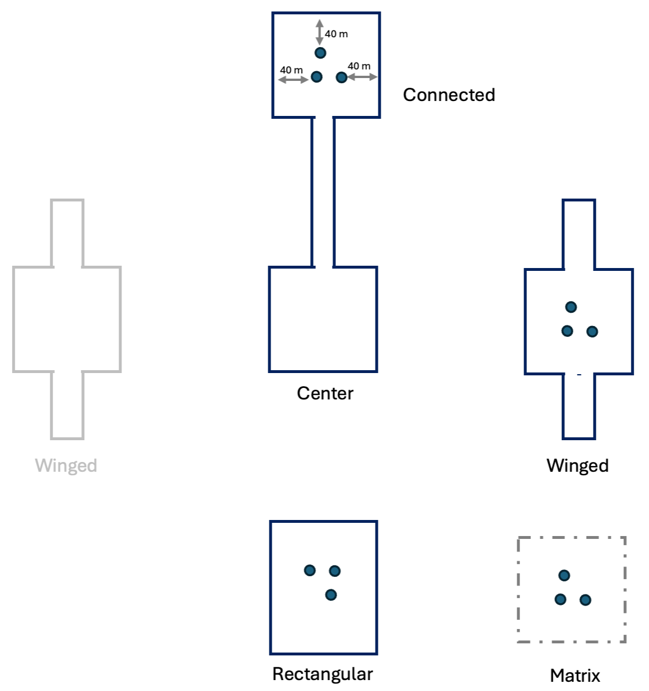
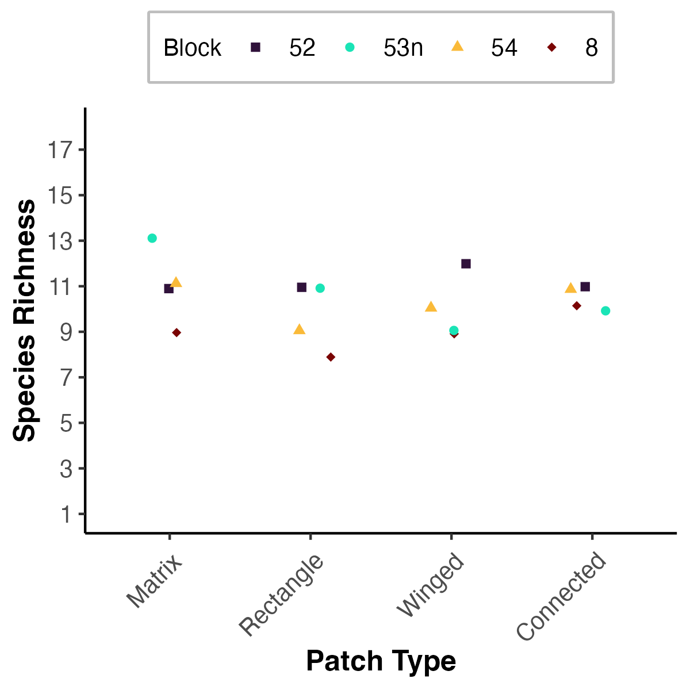

```{r GlobalOptions, include = FALSE}
options(knitr.duplicate.label = 'allow')
```


```{r setup, include = FALSE}

knitr::opts_chunk$set(echo = FALSE,message=FALSE,warning=FALSE)
library(here)
library(tidyverse)
library(kableExtra)
library(grateful)
# library(gridExtra)
# library(egg)
# library(magick)
# library(citr)
# library(devtools)
# devtools::install_github("crsh/papaja")
cite_packages(citation.style = "peerj", out.dir = ".")
```

```{r load-data, cached=TRUE, echo = FALSE, warning=FALSE, message = FALSE}

btl_data<-read_csv(here("corridor_docs","eric_ms_thesis","ms_data","data_clean","clean_btl_counts.csv"))
spp_codes<-read_csv(here("corridor_docs","eric_ms_thesis","ms_data","data_raw","species_codes.csv"))

# total beetles captured 
total_N<-btl_data %>% 
  summarise(n=sum(sum, na.rm=TRUE))

# total no of spp
total_spp<-btl_data %>% 
  select(-sum) %>% 
  pivot_longer(pvin:osyl,names_to = "species",values_to = "n") %>% 
  group_by(species) %>%
  summarize(n=sum(n, na.rm=TRUE)) %>%
  arrange(desc(n)) %>%
  mutate(species = reorder(species, desc(n))) %>% 
  summarise(n_spp=n_distinct(species))


# 
# most_common<-spp_table_data %>% select(Species) %>% slice(1)
# most_common_n<-spp_table_data %>% select(N) %>% slice(1)

```


# Abstract

Habitat fragmentation threatens biodiversity across the globe as habitat loss, isolation, and edge effects become increasingly prevalent. Corridors have become an important tool in order to combat the negative effects of fragmentation, however they are difficult to study in natural systems without incurring confounding effects.  To observe changes in insect community composition as an effect of landscape features we sampled dung beetles in a landscape scale experiment. We did not see a difference in species richness or diversity, but dung beetle abundances were higher in continuous forest habitat and open habitat patches connected by a corridors than in isolated patches. 

# TO DO LIST


Next assignment:

1) Are any of the Dung Beetles we collected considered "open habitat" specialists? (might want to look at the work on pastures in the southeast)

cvig - open sand chaparral, open grassland preference nealis 1977
mbis - open sand chapparal preference nealis 1977
open - slight preference towards open chap and shaded chap, little open grassland nealis 1977 

pign - sharing forest habitat but need more info conover 2019
pvin - open habitat but share forest with pign conover 2019
alec - forest preference conover 2019


2) Is there anything about these species that might be interesting in the context of corridors?
  - are any species known to be good fliers/movers?
    - Ospina 2018 -> wing shape py habitat preference and differences in wing shape determined by species groupings
    ^ beetles with wider wings showed more preference towards open habitat, contrary to what is already known in literature on other taxa (butterflies)
    ^ large body beetles tending towards lower energy flight strategies. maybe justification for corridor preference?
    
    = stanbrook and king 2022 -> tunnelers preferring open habitat and tunnelers also contributing more towards dung removal. 
    
  - specialists on deer dung?
    - Conover 2019 -> dung source being less of an issue than habitat type but some species were more responsive to specific bait types so future studies should use a mix of multiple bait types 
    - Gimenez Gomez et al 2021 -> similar outcome some beetles were extra sensitive to specififc baits so a mix of baits should be used. However this study was done in a more tropical ecosystem so its hard to say if the same would apply to our more temperate system so more work is needed in this specific avenue. 
  
  - navigate by starlight?
  - feeding preferences?
  
  
  
3) Did you get any species not captured in other long-leaf/SE USA forest sites?
  
4) What are hill numbers?

hill numbers are a set of biodiversity metrics designed to standardize metrics and quantify biodiversity and richness differently depending on how we want to emphasize abundance while also accounting for differences in sampling sizes and efforts (read more about this Eric)

5) What is the advantage of useing hill numbers to estimate diversity / richness?

- Chao et al. 2014 -> incorporating abundance into calculating diversity metrics is important for studying functionality in particular since some species that may not be as abundant as others may not contribute to an ecosystem function as much as others.

- ^ At the same time rare species may be filling a specific niche or we might be concerned about exotics or at risk species. 


6) Are the diversity and richness estimates calculated with hill numbers sensitive to anything, e.g., rare species/abundance, etc:

7) Find me the best example paragraph you think you read describing the use of hill numbers to estimate diversity/richness (field survey paper): _________________

8) Find me the best TWO description of using GLMM to compare abundance/diversity/richness at the Corridor Project: _________________

### Methods: 
1. ~~add a few sentences on drying, keys used to ID, and depositing vouchers~~

### Analyses
1. ~~Write a short paragraph on how you calculated and compared species richness and diversity (hill numbers, glmm). ~~
1. Write a short paragraph on how you calculated and compared functional diversity (how you measured it, how you compared it)

### Results
1. answer the overview questions, them stich them together into a paragraph
 - ~~any species restricted to 1-2 habitat types~~
 - ~~Were all species found in all blocks? Were any restricted to only 1-2 blocks?~~
 - Were all species found in the matrix? (expect that so, since it is the 'baseline' or 'source' habitat)
 - Number of species in each functional group
 - ~~most common 3-4 species~~
 - any rare species? 
 - any invasive / exotic species?

### Figures 

1. Figure of species richness results.
1. Figure of species diversity results.
1. Figure of biomass of different (R/T/D) functional groups.
1. ~~Figure of abundance of individual species.~~
1. ~~Figure of the patch layout with pitfalls.~~

### Tables

1. ~~Table: count by species by habitat.~~
1. table: results of species richness analyses.
1. table: results of species diversity analyses.
1. table: results of functional diversity analyses.

### Misc. 

1. Map of where field site is located.

1. Pictures of different species, sampling, field sites


\newpage

# INTRODUCTION

**_Note from EB:_** _I don't want to see the words 'dung beetles' until paragraph 5_.

Paragraph 1: Overall Topic & Why it is interesting and Important. _Fragmentation is an extensive problem across the globe and it is vital to understand shifts in biodiversity and community structures as a result of trophic cascades._

>As human disturbances continue to expand into natural landscapes, intact habitats are becoming increasingly fragmented. Like many ecological processes, fragmentation is a complex and multifaceted phenomenon bringing about many consequences which can be both positive and negative for ecosystems [@fahrig_effects_2003] [@fletcher_is_2018]. However, as habitats are broken down community structures are significantly altered [@WOS:000419965700012]. This alteration of structure typically lends to loss in biodiversity on a global scale and interruptions in ecosystem processes and functions [@haddad_habitat_2015]. 


Paragraph 2: What we know. _Habitat connectivity is generally viewed as beneficial for ecosystems as a whole. We know that patch shape and size can be an influental factor for how populations are configured. Wildlife corridors_

>Corridors have been shown to be an important mechanism for for minimizing negative consequences of fragmentation[@haddad_corridor_2003]. By improving habitat structure to help facilitate dispersal, wildlife corridors inform movement dynamics of local populations and can shape land uses and occupancy (insert richard forman 1995). Because of this dynamic it becomes necessary to understand responses by species compositions at all taxonomic levels and potential trophic cascades resulting from changes in habitat structure and connectivity.  

Paragraph 3: What we don't know. _Changes in ecosystem fuction as a result of shifts in community structure (EB but we may not want to emphasize this given we didn't measure directly_

>By measuring changes in biodiversity and species richness within experimental designs we are able to isolate factors might be contributing to ecological patterns and processes. Past studies have measured changes in biodiversity for many different taxa [@collins_fragmentation_2017; @graham_impact_2022; @tewksbury_corridors_2002], yet much work is still needed to build a full scope for how organisms are being effected. Furthermore it is important that we expand our knowledge on how composition changes might impact functional diversities and potential implications for the effectiveness of ecosystem services. 

<!-- stuff that these inviduals or species do: -->
<!-- 1) their interactions with other species -->
<!-- - predation -->
<!-- - pollination -->
<!-- - seed dispersal -->
<!-- 2) stuff on their own that influences ecosystems -->
<!-- - ecosystem engineering (beavers, leaf-cutter ants) -->
<!-- - nutrient cycling -->
<!-- - decomposition -->


<!-- Potential alternative routes:  -->

<!-- 1) We know far less on how corridors influence functional diversity. Functional diversity is important for the maintenance of ecosystems services, etc, so corridors cvould help ensure that.  (in context of dung beetles that would be feeding guilds (simplest), morphology etc. in deCastro Arrazola et al) -->

<!-- 2) Studies investigating corridors rarely look at whats i the matrix. The matrix could be a source of diversity that moves into patches and then through corridors or a completely different subset of species. (any other options?) Understanding whichh of these it is is important because it leads to differnt conclusions abiout role of corridors and conservation strategies -->

<!-- 3) regardless, not a bad idea to discuss both matrix and functional group in diuscussion. -->

<!-- 4) and the alternative approach: revamp into around spillover from matrix into patches and if depednent on corridors or edge  -->


<!-- Paragraph 4: Why we don't know it. _(hint: ecosystem services)_   -->

<!-- >Topic Sentence: Is this where we talk about challenges in large scale experimental design and the corridor project or is this where we talk about ecosystem services and biodiversity?  -->

Paragraph 4: Study System and why it is so excellent for this issue. _Here we talk about dung beetles how they fit into the broader scope of our question and directly state what questions we are asking._

>Dung beetles have emerged as a model system with which to test spatial ecology hypotheses [@ros_how_2012; @roslin_dung_2000].They are an incredibly well studied group of insects which are well known for driving a multitude of ecosystem functions (Hasan et al. 2024). The removal, breakdown, and burial of animal feces drive important ecosystem interactions provided by dung beetles enhancing nutrient cycling and soil quality, the reduction of breeding sites for parasites, and a reduction in methane emissions from dung [@slade_disentangling_2016; @WOS:000350444300013]
Here, we aim to gain an understanding of how dung beetles, a group of insects well known for strong dispersal ability in order to compete for ephemeral resources(Hanski and Cambefort 1991), interact with corridors in their landscapes. We sampled dung beetle communities in experimental landscapes developed for the express purposes of comparing connected and isolated patches, as well as the effects of patch to edge ratio and distance to edge. To ask the question of (1) how landscape connectivity impacts dung beetle assemblages dung beetles were collected, identified, and counted with the expectation that biodiversity and abundance would be higher in patches connected by corridors. Additionally we asked are corridors benefiting any one functional trait over another? 

<!-- Since our experimental system consists of open habitats amongst a forested matrix, we anticipate that species preferring open areas and generalists may be more common in our sampling. -->

Paragraph 5: Here is what we did to address this unknown. _The hypotheses we tested_


\newpage

# Methods

## Study site

Our study took place at the Savannah River Site (SRS), a National Environmental Research Park in southern South Carolina, US(33.208 N, 81.408 W) in four of seven experimental landscapes designed for the purposes of directly observing the impacts of corridors and patch shape on the movements of plants and animals (Tewksbury et al. 2002). Each experimental landscape, termed blocks, consists of four patches of open habitat around a central patch all together within a matrix of pine savanna. In each replicant the central patch (100 x 100 m) is always connected to one peripheral patch with identical dimensions by a 150 x 25 m corridor, this will hereafter be referred  to as the connected patch. The remaining patches are either "winged" or "rectangular".  The winged patch is also 100 x 100 m, however they exhibit their characteristic wings in the form of two 75 x 25 m offshoots meant to account for the extra area and edge space the corridor provides. The rectangular patch is 100 x 137.5 m also the same area as the space of the connected patch plus the corridor. Each block has a duplicate of either the winged or rectangle patch, all peripheral patches being 150 m from the center patch. For this study sampling was done in one of each patch type and in one matrix plot per block, all matrix blocks were set up 150 m away from the center as well. 

## Dung beetle sampling 

In the months of July and August 2024 dung beetles were sampled in 4 blocks spread across SRS, baited pitfall traps were placed in one of each patch type and in one matrix plot per block. Traps were placed in groups of 3 in the centers of each patch approximately 250 meters from the midpoint of the central patch 40 m from patch edge. Pitfalls were oriented in a triangular pattern with the bottom two traps positioned towards the center patch, each trap 20 m apart. Plots in the matrix were set up in a similar fashion with the center point 250 m from the center placed equidistant between adjacent patches. Individual pitfall traps consisted of two components, a 10cm tall by 8 cm wide cylinder base topped with a funnel with a 10cm wide rim. Pig feces was suspended above the funnel by a 6.5 cm by 6.5 cm mesh square.  For each sample period, traps were baited with pig dung between 8-9 pm and picked up 12 hours later, all beetles captured were stored in ethanol for further processing. In total 16 sampling rounds were carried out with 4 rounds per block, 196 samples were collected. 

All dung beetles were counted and identified to species as described in @nemes_illustrated_2015-1 and @edmonds_taxonomic_2023. Fifteen individuals of each species with adequate captures were dried to equalibrium and weighed for biomass measurements. Voucher specimcens for each species will be deposited at the Florida State Collection of Arthropods. 

## Analysis

Biodiversity between patch types was compared using Hill numbers (Jost 2006). Hill numbers are metrics developed with the goal of providing a unifying context for the quantification of the many ways we measure biodiversity. [delete: In our work, we use Hill numbers to explore the impacts of abundance in our diversity measurements]. They are an alternative to more specialized metrics such as _________, which are less intuitive for interpretation. [maybe a sentence on how / why hill numbers are easier to interpret?]  We looked at [compared] community composition by increasing magnitudes of diversity components (qD) of 0D (species richness), 1D (Shannon entropy), and 2D (Simpson Diversity). [can you add a sentence about how these are calculated? by whihc I mean - are the calculations different than for richness, shannon, etc.?] Diversity numbers and species richness were calculated in R studio using package `hill`.

To test for the effects of connectivity on species abundance, richness, and diversity [we compared the values of the Hill Shannon and Simpson indexes in the different patch types and matrix]. For abundance and richness we used generalized linear mixed models (i.e., GLMM) fitted to a poisson distribution. We looked at [compared...looked at sounds squishy. try to use more active verbs like compared, quantified, assessed, etc.] (1) the overall species richness and (2) the abundance of the top 6 most common species in each patch type. We included the identity of the sampling block as a random effects. To model our diversity metrics we took a similar approach, but this time using GLMMs with a Gaussian distribution. All models were fit using `lme4` package.  Prior to conducting our modeling we used _qqplots_ (`DARMa` package) to evaluate the the suitability of our data.


### Overview

<!-- _Don't have to describe these, just do it and report in results. this is just to remind us of what to do_ -->

<!-- 1. how many beetles total   -->
<!-- 1. most common species overall.   -->
<!-- 1. was. the same species the most common one in all habitats?   -->
<!-- 1. were there any that were caught in all habitats? Any restricted to only one?   -->
<!-- 1. any invasive / exotic species?   -->
<!-- 1. Table: count by species by habitat.  -->

### Species richness 

To Test for differences in species richness, we....

1. glmm with poisson dist reccomended by julian
1. table: results of analyses. 
1. visualization: hill's plots? rank-abundance plots? rarefaction curve?  

### Species diversity

We used a similar approach to compare species diversity in winged, isolated, and connected patches....

1. glmm with poisson dist reccomended by julian
1. table: results of analyses
1. visualization: hill's plots? rarefaction curve?   

### Functional diversity

1. 1nd pass: roller, tunneler, dweller
1. 2nd: morphological measurements like Alonso et al 2022 (see table from decastro 2023, Giménez Gómez 2025)
1. table: results of analyses 
1. visualization: biomass of different (R/T/D) functional groups?   

_Reason for this breakdown: _ - richness and diversity are "community level" response. abundance is a species-level response. changes in abundance or rank-abundance  could have implications for ecosystem services if it is connected to functional group. 


---

> Biodiversity between patch types was compared using Hill numbers (Jost 2006). We looked at community composition by increasing magnitudes of diversity components (qD) of 0D (species richness), 1D (Shannon entropy), and 2D (Simpson Diversity). Diversity numbers were calculated in R studio using package iNEXT (Chao et al. 2016). Bray-Curtis dissimiolarity values were calculated using package Vegan in R studio. Dung beetles were assigned traits by waste removal guild and habitat preference.  


> Functional Diversity: Need to assign each species to a functional group: roller, tunneler. dweller, others?  - habitat preference (forest, pasture, generalist)
 - what stats / computer packages did you use to analyze and visualize the data?

>_Look through dung beetle pubs and see how/what people compare_

<!--   - lets hammer this out  -->
<!--   - modeling?  -->
<!--     - glmm with poisson dist reccomended by julian -->
<!--   - beta, abundance, biomass? per site -->
<!--   - ~species list by sampling blocks (anything with this?)~ -->
<!--   - habitat preference  -->
<!--   - rarefaction -->

\newpage

# RESULTS

```{r data-load, include = FALSE, echo = TRUE, message = FALSE, warning = FALSE}

btl_data<-read_csv(here("corridor_docs","eric_ms_thesis","ms_data","data_clean","clean_btl_counts.csv"))
spp_codes<-read_csv(here("corridor_docs","eric_ms_thesis","ms_data","data_raw","species_codes.csv"))
# total beetles captured --------------------------------------------------
total_N<-btl_data %>% 
  summarise(n=sum(sum, na.rm=TRUE))

## How many species total?
total_spp<-btl_data %>% 
  select(-sum) %>% 
  pivot_longer(pvin:osyl,names_to = "species",values_to = "n") %>% 
  group_by(species) %>%
  summarize(n=sum(n, na.rm=TRUE)) %>%
  arrange(desc(n)) %>%
  mutate(species = reorder(species, desc(n))) %>% 
  summarise(n_spp=n_distinct(species))


## Abundance by species
spp_abund<-btl_data %>%
  pivot_longer(pvin:osyl,names_to = "species",values_to = "n") %>% 
  group_by(species) %>% 
  summarise(n=sum(n, na.rm=TRUE)) %>% 
  # filter(n>500) %>% 
  ungroup() %>% 
  select(species,n)%>% 
  arrange(desc(n)) %>% 
  rename("sp_code"="species") %>% 
  left_join(spp_codes) %>% 
  mutate(species=tolower(species)) %>% 
  mutate(species=paste(genus,species,sep=" ")) %>% 
  select(-c(subspecies,notes,ordway,srs,Guild,family,sp_code,genus))

## Common species 

# by number (i.e., N most common)
how_many_common<-6
most_common_spp<-spp_abund %>% 
  slice_head(n = how_many_common)
count_most_common<-sum(most_common_spp$n)

# by abundance (i.e., over NNNN sampled)
high_abund_cutoff<-500
most_common_count<-spp_abund %>% 
  filter(n>high_abund_cutoff)

## Rare species 

# by number (i.e., N most common)
how_many_rare<-4
rare_spp<-spp_abund %>% 
  slice_tail(n=how_many_rare)

# by abundance (i.e., over NNNN sampled)
low_abund_cutoff<-10
rare_spp_count<-spp_abund %>% 
  filter(n<low_abund_cutoff)


## Beetles by species and plot type (for Table 1)
btl_sums_patch<-btl_data %>%
  pivot_longer(pvin:osyl,names_to = "species",values_to = "n") %>% 
  group_by(species,patch) %>%
  summarize(n=sum(n, na.rm=TRUE)) %>%
  arrange(patch,desc(n)) %>% 
  rename(sp_code=species,
         n_patch=n) %>% 
  pivot_wider(
    names_from = patch,
    values_from = c(n_patch)) %>% 
  left_join(spp_codes) %>% 
  mutate(species=tolower(species)) %>% 
  mutate(species=paste(genus,species,sep=" ")) %>% 
  ungroup() %>% 
  select(species,Guild,m,c,w,r) %>% 
  rename(Species=species)

# which ones NOT found in all habitats?

not_in_all_hab<-btl_sums_patch %>% 
  rename(species=Species) %>% 
  left_join(spp_abund) %>% 
  select(-n,-Guild) %>% 
  mutate(row_sums=m+c+r+w) %>% 
  filter(row_sums<4)

# row_sums==1 for any restricted to only one habitat 
# row_sums==2 for any restricted to only two habitats...
  

# filter(m<1|c<1|w<1|r<1)


# This finalizes the table for Table 1

spp_table_data<-btl_sums_patch %>% 
  rename(species=Species) %>% 
  left_join(spp_abund) %>% 
  relocate(n,.after="Guild") %>% 
  mutate(c=case_when(
  c == 0 ~ " ",
  c > 0 ~ "x",
  .default = as.character(c)
)) %>% 
  mutate(m=case_when(
  m == 0 ~ " ",
  m > 0 ~ "x",
  .default = as.character(m)
)) %>% 
  mutate(r=case_when(
  r == 0 ~ " ",
  r > 0 ~ "x",
  .default = as.character(r)
)) %>% 
mutate(w=case_when(
  w == 0 ~ " ",
  w > 0 ~ "x",
  .default = as.character(w)
)) %>% 
  mutate(Guild=case_when(
  Guild == "r" ~ "roll",
  Guild == "t" ~ "tunnell",
  Guild == "d" ~ "dwell",
  .default = as.character(Guild)
)) %>% 
  rename(Species=species,
         N=n,
         Matrix=m,
         Corridor=c,
         Winged=w,
         Rectangular=r)


```

## Community Composition and Abundance

Overall, I collected N = `r total_N` dung beetles belonging to N = `r total_spp` species. The N = `r how_many_common` species comprised of `r round((count_most_common/total_N)*100,1)`% of all captures: _Canthon vigilans_ (N = `r most_common_spp[1,1]`), _Ateuchus lecontei_ (N = `r most_common_spp[2,1]`), _Phanaeus igneus_ (N = `r most_common_spp[3,1]`), _Dichotomius carolinus_ (N = `r most_common_spp[4,1]`), _Aphodeus alloblackburneus_ (N = `r most_common_spp[5,1]`), and _Onthophagus pennsylvanicus_ (N = `r most_common_spp[6,1]`; Table 1). All but four species were captured in every patch type. _Onthophagus concinnus_ was only found in the matrix and winged patches, while _Onthophagus striatulus_ was only captured in matrix habitat and rectangular patches. _Geotrupes blackburnii_ and _Onthophagus tuberculifrons_ were the only species restricted to one patch type (winged and matrix, respectively).

Wegen comparing the total abundance of beetles (all species combined) across patch types, there were no significant difference with one exception: fewer individuals were captured in rectangulat patches. Statistical analysis of abundance relating to abundance focused on the six most abundant species. 

### _QUESTION FOR EMILIO_ <-------
And then here I want to talk about model M3 in 04_GLMM but this one is tricky there is a lot going on when looking at the model summary what should be the important info to report? 

FROM EB: THE BIG BICTURE - sometimes the big picture is a clear effect (abundance of all species was higher in the winged patches). SOmetimes it is a split result (eg abundance of species a higher in winged, abund of species b higher in connected). And sometimes it is messy. that looks like the case here, so say that in thesis language: "the results were highly variable, with some species higher in A (eg, spec 1, 2) whiole others were higher in b (sp 3,4). For some species there was no effect of patch type on abundance (sp 5). Complete results are in table X.  in other words in some cases "a lot going on" IS the message. 


What i think is significant:  
when looking at counts for our most abundant species most follow a similar pattern where the most individuals of a given species are most frequent in the matrix then corridor and matrix with a dip at the rectangle patch. One difference to note is that _Aphodeus alloblackburneus_ had much higher counts in matrix patches in contrast to other patch types. 

EB: there you go! That's how its done.

## Species Richness

### Another _QUESTION FOR EMILIO_ <-------
How best can I expand upon this more and same question for hill numbers, maybe means?


Differences in species richness showed no significance across patch types. 

FROM EB: THIS IS WHAT YOU NEED TO SAY IN THE RESULTS. you can add a little. ("The hill numbers ranged from X in habitat Y to X in habitat z. However, there was no significant...") You expand on what it *means* in the discussion. Here just report the facts.

## Biodiversity


### Overview

1. total number of beetles from total number of species: `r total_N` beetles from `r total_spp` species.

1. All but four species species were found in every patch type. _Onthophagus concinnus_ was found in the matrix and winged patches, while _Onthophagus striatulus_ was found in matrix habitat and rectanular patches. _Geotrupes blackburnii_ and _Onthophagus tuberculifrons_ were the only species restricted to one patch type (winged and matrix, respectively).

1. Were all species found in all blocks? Were any restricted to only 1-2 blocks?

1. Were all species found in the matrix? (expect that so, since it is the 'baseline' or 'source' habitat)

1. Number of species in each functional group

1. most common 3-4 species: The `r how_many_common` most common species were \textit{`r most_common_spp[1,2]`} (N = `r most_common_spp[1,1]`), \textit{`r most_common_spp[2,2]`} (N = `r most_common_spp[2,1]`), and \textit{`r most_common_spp[3,2]`} (N = `r most_common_spp[3,1]`).
1. any rare species? 
1. any invasive / exotic species?

### Species richness 


### Species diversity

### Functional diversity


\newpage

# DISCUSSION

Recap main goals into findings
 abundances in matrix vs connected patch and why this could be happening
 - source pop to habiitat edge
 
 species richness again supporting that matrix is more of an ideal habitat for dung beetle community 
 
 diversity indices community structures weren't highly different between patch types 
 
 bray curtis hinting at similar land uses between corridor and winged patch
 - like julians paper corridors benefit certain populations and more fit populations are able to make better use
 
Interpretation of results
 Abundance 
 - reasin for highest abundances in matrix and connected patch
 - lower abundance in rectangle hinting at fragmentation effects
 Species Richness & Diversity
 - the role of hbitat connectivity in shaping community structure or lack thereof
 - why do we think connnected had lowest species richness??
 Functional traits and ecological impacts
 - did corridoors favor a functional trait
 - why might there be a trait response 
 - implications for ecosystem processes
 - like duung removal papers seed dispersal and yep
 
Comparing to previous studies
- how are things aligning
- think about the biology 

Limitations and future work
- potential confounding factors (seasonality, distance from edge, sampling methodology and temmporal variation)
- other directions to go (dispersal -> radar, secifically measuring changes in ecosystem services)

Takeaways for conservation and management
- dung beetles are robust
- what do think about corridor design and considerations for fragmented lanndscapes
- practical applications think about the beetles 

# ACKNOWLEDGMENTS

We thank the USDA Forest Service for maintaining experimental landscapes and assisting in getting established at the site, particularly Sabrie Breland, Ben Overly, and Eva Schwarz. We also thank Thomas Smith for his help in data collection, Sara Escobar-Chena for her help in processing and data entry, and to Nico Acajabon, Jarrett Emory, and Cayla Garmen for their advice in putting together this manuscript. 


\newpage


# REFERENCES

\smallskip  
::: {#refs}
:::


\newpage
# FIGURES & TABLES


1. ~~Table: count by species by habitat.~~
1. table: results of species richness analyses.
1. Figure of species richness results.
1. table: results of species diversity analyses.
1. Figure of species diversity results.
1. table: results of functional diversity analyses.
1. Figure of biomass of different (R/T/D) functional groups.
1. Map of where field site is located.
1. ~~Figure of the patch layout with pitfalls~~.
1. Pictures of different species, sampling, field sites?

\newpage

 
<!-- ```{r  label = pitfalls, echo = TRUE, fig.cap = "Experimental landscapes indicating location of the pitfall traps.", out.width = '50%'} -->
<!-- knitr::include_graphics('./corridor_docs/eric_ms_thesis/pitfalls.png') -->
<!-- ``` -->

{height=50%}

<!-- ```{r Figure_hill, echo=FALSE,message = FALSE,warning=FALSE} -->
<!-- library(iNEXT) -->
<!-- # -->
<!-- # btl_data<-read_csv(here("corridor_docs","eric_ms_thesis","ms_data","data_clean","clean_btl_counts.csv")) -->
<!-- # spp_codes<-read_csv(here("corridor_docs","eric_ms_thesis","ms_data","data_raw","species_codes.csv")) -->

<!-- btl_sums_patch<-btl_data %>% -->
<!--   pivot_longer(pvin:osyl,names_to = "species",values_to = "n") %>% -->
<!--   group_by(species,patch,block) %>% -->
<!--   mutate(patch=case_when( -->
<!--     patch == "c" ~ "Corridor", -->
<!--     patch == "m" ~ "Matrix", -->
<!--     patch == "w" ~ "Winged", -->
<!--     patch == "r" ~ "Rectangle", -->
<!--     .default = as.character(patch))) %>% -->
<!--   summarize(n=sum(n, na.rm=TRUE)) %>% -->
<!--   arrange(patch,desc(n)) %>% -->
<!--   rename(sp_code=species, -->
<!--          n_patch=n) %>% -->
<!--   mutate(pb=paste(patch,block,sep="-")) %>%  -->
<!--   ungroup() %>%  -->
<!--   select(-patch,-block) %>%  -->
<!--   pivot_wider( -->
<!--     names_from = pb, -->
<!--     values_from = c(n_patch))  -->


<!-- div.data <- btl_sums_patch |> -->
<!--   column_to_rownames(var = "sp_code") -->


<!-- div.btl <- iNEXT(div.data, q = c(0,1,2), datatype = "abundance") -->

<!-- z <- iNEXT(div.data, q=c(0,1,2), datatype="abundance") -->
<!-- ggiNEXT(z, facet.var="Order.q", color.var="Assemblage") + -->
<!--   theme_bw(base_size=18) -->

<!-- ``` -->


\newpage


{height=100%}


<!-- ```{r sp_richness_patches, echo = FALSE, fig.cap = "Dung beetle secies richness in three different --- and the forest matrix surrounding patches.", out.width = '100%'} -->
<!-- knitr::include_graphics("./corridor_beetles/corridor_docs/eric_ms_thesis/images/sp_richness_patches.png") -->
<!-- ``` -->

\newpage
```{r Table1, echo=FALSE,message = FALSE,warning=FALSE}
# https://cran.r-project.org/web/packages/kableExtra/vignettes/awesome_table_in_html.html


spp_table<-knitr::kable(spp_table_data, 
      digits = 2,
      align="lcrcccc",
      format="latex",
      row.names = FALSE,
      booktabs=T,
      linesep = "", #removes the blank line after every 5 lines
      caption = "Dung beetle species sampled in the SRS site and their total abundance over the course of the study.") %>%
  kable_styling(bootstrap_options = c("striped"),
                full_width = F,
                latex_options="scale_down",
                font_size = 12,
                position = "center") %>% 
  column_spec(1, italic = T) %>% 
  row_spec(0, bold = T) %>% 
  row_spec(1:15, hline_after = T) 
spp_table


```
---

\newpage


```{r Table2, echo=FALSE,message = FALSE,warning=FALSE}
# https://cran.r-project.org/web/packages/kableExtra/vignettes/awesome_table_in_html.html

btl_data<-read_csv(here("corridor_docs","eric_ms_thesis","ms_data","data_clean","clean_btl_counts.csv"))
spp_codes<-read_csv(here("corridor_docs","eric_ms_thesis","ms_data","data_raw","species_codes.csv"))


btl_sums_patch<-btl_data %>%
  select(-sum) %>%
  pivot_longer(pvin:osyl,names_to = "species",values_to = "n") %>%
  group_by(patch) %>%
  summarize(n=sum(n, na.rm=TRUE)) %>%
  arrange(patch,desc(n)) %>%
  mutate(patch=case_when(
    patch == "c" ~ "Corridor",
    patch == "m" ~ "Matrix",
    patch == "w" ~ "Winged",
    patch == "r" ~ "Rectangle",
    .default = as.character(patch)))


abund_patch <- knitr::kable(btl_sums_patch,
      digits = 2,
      align="lr",
      format="latex",
      row.names = FALSE,
      booktabs=T,
      linesep = "", #removes the blank line after every 5 lines
      caption = "Total dung beetles captured in all replicates of a patch type.") %>%
  kable_styling(bootstrap_options = c("striped"),
                full_width = F,
                latex_options="scale_down",
                font_size = 12,
                position = "center") %>%
  # column_spec(1, italic = T) %>%
  row_spec(0, bold = T)
  # row_spec(1:15, hline_after = T)
abund_patch

```


```{r Table 3, echo=FALSE,message = FALSE,warning=FALSE}
btl_spec_patch<- btl_data |>
  pivot_longer(pvin:osyl, names_to = "species", values_to = "n") |>
  group_by(species,patch) |>
  summarise(n=sum(n, na.rm=TRUE)) |>
  arrange(patch,desc(n)) |>
  pivot_wider(values_from=n,names_from=species) |>
  mutate(patch=case_when(
    patch == "c" ~ "Corridor",
    patch == "m" ~ "Matrix",
    patch == "w" ~ "Winged",
    patch == "r" ~ "Rectangle",
    .default = as.character(patch))) |>
  column_to_rownames("patch")

taxa_bray <- vegan::vegdist(btl_spec_patch, method = "bray", binary = FALSE)
# taxa_bray


```
---

\newpage 

# OTHER REQUIRED TEXT

## Dedication 
To my family who never stopped supporting me along this journey, my friends who kept me company along the way, and my mentors at VCU who believed in me before I did myself. 


## List of Abbreviations

1. SRS:	Savannah River Site. 
1. Another word:	And the list continues with another definition.  

## Biographical Sketch

Eric Escobar-Chena completed his Bachelors education at Virginia Commonwealth University in 2023. During his time there he developed a fondness for insects which  grew into a curiosity of the natural world. He later began to explore this curiosity deeper in beginning his graduate education at the University of Florida as a Master's Student under the supervision of Emilio Bruna. 


\newpage

## Text Sandbox

As human disturbances continue to expand into natural landscapes, intact habitats are becoming increasingly fragmented. This degradation lends to loss in biodiversity on a global scale and interruptions in ecosystem processes and functions [@haddad_habitat_2015]. Effects from isolation can vary, however as habitats are broken down community structures are significantly altered [@WOS:000419965700012]. Corridors have been shown to be an important mechanism for facilitating the movement of organisms through fragmented landscapes with the goal of minimizing negative consequences of fragmentation[@haddad_corridor_2003]. As disturbance continues to intensify, it is becoming increasingly more important to understand how different taxonomic groups. Here, we aim to gain an understanding of how dung beetles, a group of insects well known for strong dispersal ability in order to compete for ephemeral resources(Hanski and Cambefort 1991), interact with corridors in their landscapes.  

Dung beetles have emerged as a model system with which to test spatial ecology hypotheses [@ros_how_2012; @roslin_dung_2000].They are an incredibly well studied group of insects which are well known for driving a multitude of ecosystem functions (Hasan et al. 2024). The removal, breakdown, and burial of animal feces drive important ecostystem interactions provided by dung beetles enhancing nutrient cycling and soil quality, the reduction of breeding sites for parasites, and a reduction in methane emissions from dung [@slade_disentangling_2016; @WOS:000350444300013]. Local assemblages of dung beetles can be species-rich with species comprising a broad range of functional traits (e.g., size, foraging style, resource-use) [@WOS:000891747700001]. Previous studies have shown that isolated patches of habitat frequently have lower dung beetle diversity and abundance than areas of continuous habitat, as well as documented their presence in linear strips of habitat that resemble corridors [@WOS:000707546700001].  Past studies have also focused on how landscape structure alters the community compositions of dung beetles[@WOS:000398662200001], yet large landscape scale experimental studies with carefully controlled and replicated treatments are non-existent for this model species.

Here, we  aim to determine how connectivity and fragmentation affect Species Richness and Diversity, Abundance, and functional diversity. We sampled dung beetle communities in experimental landscapes developed for the express purposes of comparing connected and isolated patches, as well as the effects of patch to edge ratio and distance to edge. To ask the question of (1) how landscape connectivity impacts dung beetle assemblages dung beetles were collected, identified, and counted with the expectation that biodiversity and abundance would be higher in patches connected by corridors. Additionally we asked (2) Are corridors benefiting any one functional trait over another? Since our experimental system consists of open habitats amongst a forested matrix, we anticipate that species preferring open areas and generalists may be more common in our sampling. 