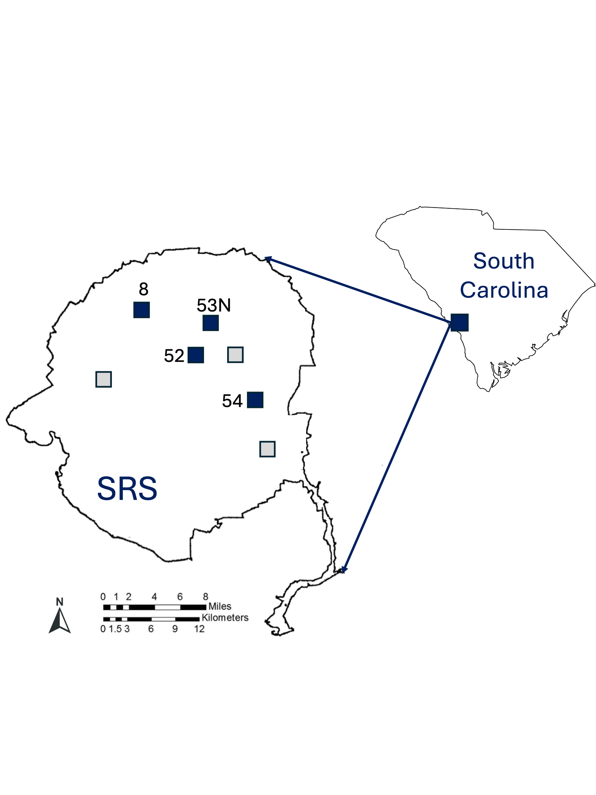
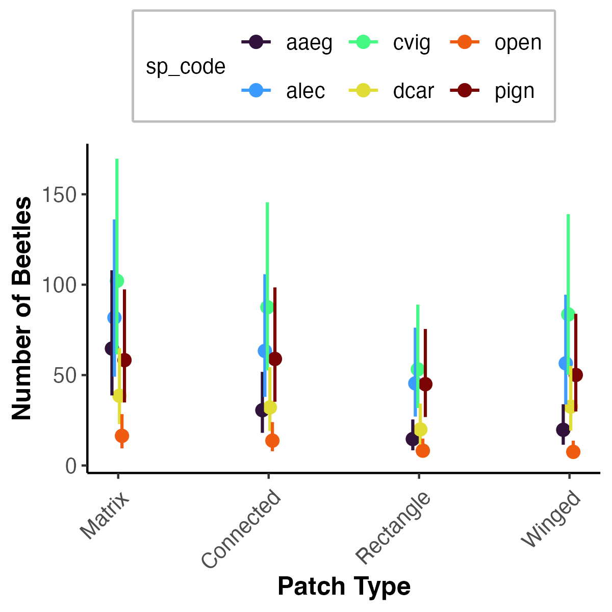
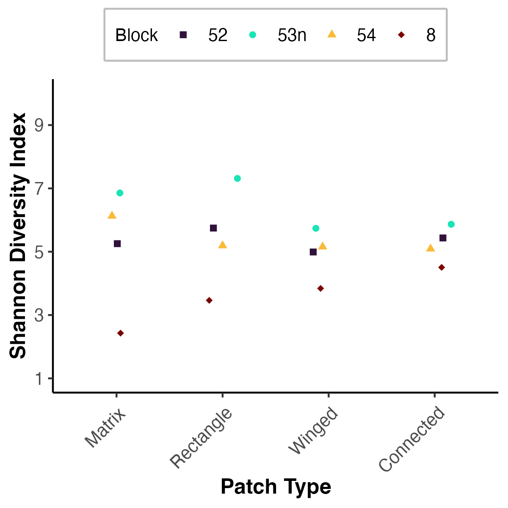

```{r GlobalOptions, include = FALSE}
options(knitr.duplicate.label = 'allow')
options(knitr.graphics.error = FALSE)  # This allows for the include_graphics to not use the path from root 
knitr::opts_chunk$set(echo = TRUE, fig.align="center")
knitr::opts_chunk$set(fig.pos = "H", out.extra = "")
knitr::opts_chunk$set(tab.pos = "H", out.extra = "")
```

```{r setup, include = FALSE}

knitr::opts_chunk$set(echo = FALSE,message=FALSE,warning=FALSE)
library(here)
library(tidyverse)
library(kableExtra)
# library(grateful)
library(knitr)
# library(grid)
library(gridExtra)
library(png)
# library(egg)
library(magick)
# library(citr)
# library(devtools)
# devtools::install_github("crsh/papaja")
# cite_packages(citation.style = "peerj", out.dir = ".")
```

```{r load-data, cached=TRUE, echo = FALSE, warning=FALSE, message = FALSE}

btl_data<-read_csv(here("corridor_docs","eric_ms_thesis","ms_data","data_clean","clean_btl_counts.csv"))
spp_codes<-read_csv(here("corridor_docs","eric_ms_thesis","ms_data","data_raw","species_codes.csv"))
bmass<-read_csv(here("corridor_docs","eric_ms_thesis","ms_data","data_raw","biomass_per_spp.csv"))
  


# total beetles captured 
total_N<-btl_data %>% 
  summarise(n=sum(sum, na.rm=TRUE))

# total no of spp
total_spp<-btl_data %>% 
  select(-sum) %>% 
  pivot_longer(pvin:osyl,names_to = "species",values_to = "n") %>% 
  group_by(species) %>%
  summarize(n=sum(n, na.rm=TRUE)) %>%
  arrange(desc(n)) %>%
  mutate(species = reorder(species, desc(n))) %>% 
  summarise(n_spp=n_distinct(species))


# biomass
bmass<-bmass %>%
  rename(sp_code=species) %>% 
  left_join(spp_codes) %>% 
  mutate(species=tolower(species)) %>% 
  mutate(species=paste(genus, species, sep=" ")) %>% 
  select(species,
         `Individual Biomass (mean)`=avg_ind_bmass,
         SD=sd) %>% 
  mutate(SD=round(SD,3)) %>% 
  mutate(SD=as.character(SD)) %>% 
  replace_na(list(SD=""))
  
  

# 
# most_common<-spp_table_data %>% select(Species) %>% slice(1)
# most_common_n<-spp_table_data %>% select(N) %>% slice(1)

```
\newpage

\vspace*{5cm}

\begin{center}
THE INFLUENCE OF CONNECTIVITY ON DUNG BEETLE COMMUNITIES
\end{center}

\vspace{5cm}

\begin{center}
By
\end{center}

\vspace{1cm}

\begin{center}
ERIC ESCOBAR-CHENA
\end{center}

\vspace{5cm}

\begin{center}
A THESIS PRESENTED TO THE GRADUATE SCHOOL\\  
OF THE UNIVERSITY OF FLORIDA IN PARTIAL FULFILLMENT\\ 
OF THE REQUIREMENTS FOR THE DEGREE OF\\  
MASTER OF SCIENCE\\
\end{center}

\begin{center}
UNIVERSITY OF FLORIDA
\end{center}

\begin{center}
2025
\end{center}


\newpage

\vspace*{11cm}

   
   
   
\begin{center}
© 2025 Eric Escobar-Chena
\end{center}


\newpage  


\vspace*{10cm} 
<!-- _Your dedication is typed here. It should begin with the word “To.” (To my Mom is a typical dedication) If your dedication is longer than a single line it should be single-spaced, and centered vertically and horizontally_ -->

\begin{center}
To my mom, dad, and two sisters. This thesis is a chapter in our immigrant story. 
\end{center}


\newpage  

\begin{center}  

\textbf{ACKNOWLEDGMENTS}  

\end{center}
<!-- _Acknowledgments must be written in complete sentences. Do not use direct address. For example, instead of Thanks, Mom and Dad!, you should say I thank my parents._  -->
\doublespacing 

I thank the USDA Forest Service for maintaining experimental landscapes and assisting in getting established at the site. I also wanted to specifically thank Thomas Smith for his help in data collection, Sara Escobar-Chena for her help in processing and data entry. 


\newpage   

\begin{center}  
\textbf{LIST OF ABBREVIATIONS}
\end{center}  

\vspace{1cm}  

\begin{flushleft}

SRS: Savannah River Site.  

GLMM: Generalized Linear Mixed Model.  


\end{flushleft}

\newpage

\vspace*{5cm}  

\singlespacing 

\begin{center}  
Abstract of Thesis Presented to the Graduate School\\  
of the University of Florida in Partial Fulfillment of the\\  
Requirements for the Degree of Master of Science.\\   
\end{center}

\vspace*{1cm}  

\begin{center}
THE INFLUENCE OF CONNECTIVITY ON DUNG BEETLE COMMUNITIES
\end{center}

\begin{center}
By
\end{center}

\begin{center}
Eric Escobar-Chena   
\end{center}

\begin{center}
August 2025   
\end{center}  

\begin{flushleft}
Chair: Emilio Bruna\\  
Major: Wildlife Ecology and Conservation\\   
\end{flushleft}

\doublespacing 

Habitat fragmentation threatens biodiversity across the globe as habitat loss, isolation, and edge effects become increasingly prevalent. Corridors have become an important tool in order to combat the negative effects of fragmentation, however they are difficult to study in natural systems without incurring confounding effects. To observe changes in insect community composition as an effect of landscape features I sampled dung beetles in a landscape scale experiment. I did not see a difference in species richness or diversity, but dung beetle abundances were higher in continuous forest habitat and open habitat patches connected by a corridors than in isolated patches.

\newpage


\begin{center}
CHAPTER 1\\  
INTRODUCTION\\  
\end{center}  

\doublespacing 


Corridors have been shown to be an important mechanism for facilitating the movement of organisms through fragmented landscapes [@haddad_corridor_2003]. These movements are hypothesized to prevent species diversity from declining in fragments, as well as help maintain the ecosystem services provided by these species (at both the patch- and landscape-level)[@burt_ants_2022]. Although there is some evidence that animals disperse between patches via corridors, and that connected patches have higher species diversity than unconnected ones, little work to date has investigated the consequences of these corridor-driven patterns for ecosystem services. 


\newpage


\begin{center}
CHAPTER 2\\  
THE INFLUENCE OF CONNECTIVITY ON DUNG BEETLE COMMUNITIES\\  
\end{center}  

\doublespacing 


As human disturbances continue to expand into natural landscapes, intact habitats are becoming increasingly fragmented [@diaz_pervasive_2019; @ma_global_2023; @taubert_global_2018]. Like many ecological processes, fragmentation is a complex and multifaceted phenomenon bringing about many consequences which can be both positive and negative for ecosystems [@fahrig_effects_2003; @fletcher_is_2018]. However, as habitats are broken down community structures are significantly altered [@WOS:000419965700012; @haddad_corridor_2003; @jennings_composition_2006; @harrison_habitat_1999]. This alteration of structure typically lends to loss in biodiversity on a global scale and interruptions in ecosystem processes and functions  [@haddad_habitat_2015].

Corridors have been shown to be an important mechanism for for minimizing negative consequences of fragmentation [@haddad_corridor_2003]. By improving habitat structure to help facilitate dispersal, wildlife corridors inform movement dynamics of local populations and can shape land uses and occupancy [@forman_general_1995]. The resulting changes in species composition are important to identify because any species impacted would have corresponding effects depending on how they interact with the ecosystem [@zhou_linking_2023]. Any gain or loss in key members of an community could disrupt processes which on their own could shape ecosystems [@WOS:000374962000009], or effect other organisms which rely on said interaction [@wu_brown-world_2011]. Because of this dynamic it becomes necessary to understand responses by species compositions at all taxonomic levels and potential trophic cascades resulting from changes in habitat structure and connectivity [@debinski_survey_2000].


<!-- stuff that these inviduals or species do: -->

<!-- 1) their interactions with other species -->

<!-- - predation -->

<!-- - pollination -->

<!-- - seed dispersal -->

<!-- 2) stuff on their own that influences ecosystems -->

<!-- - ecosystem engineering (beavers, leaf-cutter ants) -->

<!-- - nutrient cycling -->

<!-- - decomposition -->

By measuring changes in biodiversity and species richness within experimental designs I am able to isolate factors might be contributing to ecological patterns and processes [@fletcher_jr_landscape_2023; @resasco_contribution_2017]. Past studies have endeavored to experimentally measure changes in community compositions as a result of connecting habitats with corridors [@collins_fragmentation_2017; @graham_impact_2022; @tewksbury_corridors_2002]  Yet very few have directly compared matrix and patch populations. Land use is different from one species to another so it is vital to understand where compositions are distributed and what processes might be driving population differences[@haddad_corridor_1999]. 


<!-- 1) We know far less on how corridors influence functional diversity. Functional diversity is important for the maintenance of ecosystems services, etc, so corridors cvould help ensure that.  (in context of dung beetles that would be feeding guilds (simplest), morphology etc. in deCastro Arrazola et al) -->

<!-- 2) Studies investigating corridors rarely look at whats i the matrix. The matrix could be a source of diversity that moves into patches and then through corridors or a completely different subset of species. (any other options?) Understanding whichh of these it is is important because it leads to differnt conclusions abiout role of corridors and conservation strategies. can also be spillover from matrix into patches and if depednent on corridors or edge -->

Dung beetles have emerged as a model system with which to test spatial ecology hypotheses [@ros_how_2012; @roslin_dung_2000].They are an incredibly well studied group of insects which are well known for driving a multitude of ecosystem functions [@hasan_dung_2024]. The removal, breakdown, and burial of animal feces drive important ecosystem interactions provided by dung beetles enhancing nutrient cycling and soil quality, the reduction of breeding sites for parasites, and a reduction in methane emissions from dung [@slade_disentangling_2016; @WOS:000350444300013; @nichols_ecological_2008]. Local assemblages of dung beetles can be species-rich with species comprising a broad range of functional traits [e.g., size, foraging style, resource-use, [@decastro-arrazola_trait-based_2023; @ospina-garces_dung_2018]]. Previous studies have shown that isolated patches of habitat frequently have lower dung beetle diversity and abundance than areas of continuous habitat, as well as documented their presence in linear strips of habitat that resemble corridors [@WOS:000707546700001]. Past studies have also focused on how landscape structure alters the community compositions of dung beetles[@WOS:000398662200001], yet large landscape scale experimental studies with carefully controlled and replicated treatments are non-existent for this model species.

Here, I aim to gain an understanding of how dung beetles, a group of insects well known for strong dispersal ability in order to compete for ephemeral resources [@hanski_dung_1991], interact with corridors in their landscapes. I sampled dung beetle communities in experimental landscapes developed for the express purposes of comparing connected and isolated patches, as well as the effects of patch area to edge ratio and distance to edge [@tewksbury_corridors_2002]. I do so I address these  questions: 

(1) How does the abundance of dung beetles differ among and between isolated and connected patches and how does this compare with abundance in matrix habitat?
(2) Does species richness and diversity differ between among connected patches, unconnected patches, and the matrix habitat?
(3) What are the implications of changes in community composition for ecosystem services and function?  

<!--how landscape connectivity impacts dung beetle assemblages dung beetles were collected, identified, and counted with the expectation that biodiversity and abundance would be higher in patches connected by corridors. Additionally we asked are corridors benefiting any one functional trait over another? -->

<!-- Since our experimental system consists of open habitats amongst a forested matrix, we anticipate that species preferring open areas and generalists may be more common in our sampling. -->

\begin{center} 
\textbf{Methods}
\end{center}
### Study site

My study took place at the Savannah River Site (SRS), a National Environmental Research Park in southern South Carolina, USA (33.208$^\circ$ N, 81.408$^\circ$ W, Figure \@ref(fig:srs-map)). in four of seven experimental landscapes designed for the purposes of directly observing the impacts of corridors and patch shape on the movements of plants and animals [@tewksbury_corridors_2002]. Each experimental landscape, termed blocks, consists of four patches of open habitat around a central patch all together within a matrix of pine savanna (Figure \@ref(fig:patches)). In each block the central patch (100 $\times$ 100 m) is always connected to one peripheral patch with identical dimensions by a 150 $\times$ 25 m corridor, this will hereafter be referred to as the connected patch. The remaining patches are either "winged" or "rectangular". The winged patch is also 100 $\times$ 100 m, however they exhibit their characteristic wings in the form of two 75 $\times$ 25 m offshoots meant to account for the extra area and edge space the corridor provides. The rectangular patch is 100 $\times$ 137.5 m also the same area as the space of the connected patch plus the corridor. Each block has a duplicate of either the winged or rectangle patch, all peripheral patches being 150 m from the center patch. For this study sampling was done in one of each patch type and in one matrix plot per block, all matrix blocks were set up 150 m away from the center as well.

### Dung beetle sampling

Dung beetles were sampled in July and August 2024 in four of the SRS blocks (8, 52, 53n, and 54; Figure \@ref(fig:srs-map)). In each block sampling was conducted using baited pitfall traps placed in each patch type as well as the matrix surrounding the patches (Figure \@ref(fig:pitfalls)). Traps were placed in groups of 3 in the centers of each patch, approximately 250 meters from the midpoint of the central patch 40 m from patch edge. Pitfalls were oriented in a triangular pattern with the bottom two traps positioned towards the center patch, each trap 20 m apart. Plots in the matrix were set up in a similar fashion with the center point 250 m from the center placed equidistant between adjacent patches. Individual pitfall traps consisted of two components, a 10cm tall by 8 cm wide cylinder base topped with a funnel with a 10cm wide rim. I sourced pig feces from the University of Florida Swine Barn Unit. Bait was processed into 5cm wide balls and wrapped in a layer of coffee filter material. For each sample period, traps were buried flush with the ground and baited with pig dung between 8-9 pm and picked up 12 hours later, all beetles captured were stored in ethanol for further processing. In total 16 sampling rounds were carried out with 4 rounds per block, 196 samples were collected.

All dung beetles were counted and identified to species using @nemes_illustrated_2015 and @edmonds_taxonomic_2023. Fifteen individuals of each species with adequate captures were dried and weighed for biomass measurements. Ten species had the required counts for weighing which I dried in drying oven until all specimen reached a stable mass. I weighed each beetle using an Ohaus Adventurer Pro AV53 microbalance, with the exception of individuals whose weights were extremely small. Individual biomass for these species was estimated by weighing in batches of N = 3 (i.e., *Ateuchus lecontei*), N = 5 (i.e., *Onthophagus pennsylvanicus*), or N = 15 (i.e., *Aphodius alloblackburneus*) and then calculated by average biomass per beetle. Values for individual biomass were then used to estimate the total biomass of each species in each patch, as well as the total beetle biomass (i.e., all species combined) in each patch. Voucher specimens for each species will be deposited at the Florida State Collection of Arthropods upon completion of all analyses. 

### Analyses

Biodiversity between patch types was compared using Hill numbers, a set of indexes developed with the goal of providing a unifying context for the quantification of the many ways we measure biodiversity [@jost_entropy_2006]. They are an alternative to more specialized metrics such as alpha, beta, and gamma diversities while being more standardized than other indexes such as Renyi or HCDT entropies, of which both groups of metrics are less intuitive for interpretation. Hill numbers are now the preferred metric for describing community dynamics for two reasons. First, they are extrapolated from the same equation, manipulating a single parameter (i.e., *q*) to arrive at estimates of richness and diversity. Second, by manipulating *q* we can gain an understanding of compositional shifts otherwise obscured while using species richness [@chao_rarefaction_2014]. I compared community composition by increasing magnitudes of diversity components (i.e., *qD*) of *0D* (i.e., species richness), *1D* (i.e., Shannon entropy), and *2D* (i.e, Simpson Diversity). Diversity numbers and species richness were calculated using the package `hill` [@li_hillr_2018] for the R statistical programming language [@posit_team_rstudio_2025]. Diversity numbers were calculated using package `iNEXT` [@hsieh_inext_2016]. Bray-Curtis dissimilarity values were calculated using package `Vegan` [@oksanen_vegan_2025]. Dung beetles were assigned traits by waste removal guild and habitat preference.

To test for the effects of connectivity on abundance, species richness, and species diversity I compared the values of the Hill Shannon and Simpson indexes in the different patch types and matrix. For abundance and richness I used generalized linear mixed models (i.e., GLMM) fitted to a poisson distribution [@bolker_generalized_2009]. Compared (1) the overall species richness and (2) the abundance of the top 6 most common species in each patch type. I included the identity of the sampling block as a random effects. To model my diversity metrics I took a similar approach, but this time using linear mixed effects models with a Gaussian distribution [@chao_rarefaction_2014]. In all models, the reference level for patch type was Matrix. All models were fit using `lme4` package [@bates_fitting_2015]. Prior to conducting my modeling I evaluated the the suitability of my data with *qqplots* generated with the `DARMa` package [@hartig_dharma_2024].

I used linear mixed-effects models to compare the influence of patch type on both Shannon Diversity and Simpson's indexes, including block as a random effect to account for spatial variation. Across both diversity models, the block-level random effect standard deviation was slightly greater than the residual error, indicating that variation between blocks accounted for a substantial portion of the overall variability. Likewise, I used linear mixed-effects models to compare for differences between patch types in (1) total dung beetle biomass, and (2) the total biomass of each of the ten species, again including block as a random effect.


<!-- ### Functional diversity -->

<!-- 1. 1nd pass: roller, tunneler, dweller -->

<!-- 1. 2nd: morphological measurements like Alonso et al 2022 (see table from decastro 2023, Giménez Gómez 2025) -->

<!-- 1. table: results of analyses  -->

<!-- 1. visualization: biomass of different (R/T/D) functional groups?    -->

<!-- _Reason for this breakdown: _ - richness and diversity are "community level" response. abundance is a species-level response. changes in abundance or rank-abundance  could have implications for ecosystem services if it is connected to functional group.  -->

<!-- Functional Diversity: Need to assign each species to a functional group: roller, tunneler. dweller, others?  - habitat preference (forest, pasture, generalist). Look through dung beetle pubs and see how/what people compare_ what stats / computer packages did you use to analyze and visualize the data? -->

\begin{center} 
\textbf{Results}
\end{center}

```{r data-load, include = FALSE, echo = TRUE, message = FALSE, warning = FALSE}

btl_data<-read_csv(here("corridor_docs","eric_ms_thesis","ms_data","data_clean","clean_btl_counts.csv"))
spp_codes<-read_csv(here("corridor_docs","eric_ms_thesis","ms_data","data_raw","species_codes.csv"))
# total beetles captured --------------------------------------------------
total_N<-btl_data %>% 
  summarise(n=sum(sum, na.rm=TRUE))

## How many species total?
total_spp<-btl_data %>% 
  select(-sum) %>% 
  pivot_longer(pvin:osyl,names_to = "species",values_to = "n") %>% 
  group_by(species) %>%
  summarize(n=sum(n, na.rm=TRUE)) %>%
  arrange(desc(n)) %>%
  mutate(species = reorder(species, desc(n))) %>% 
  summarise(n_spp=n_distinct(species))

## Abund by patch


btl_sums_patch<-btl_data %>%
  select(-sum) %>%
  pivot_longer(pvin:osyl,names_to = "species",values_to = "n") %>%
  group_by(patch) %>%
  summarize(n=sum(n, na.rm=TRUE)) 

n_corr<-btl_sums_patch %>% filter(patch=="c") %>% select(n) %>% as.numeric()
n_mat<-btl_sums_patch %>% filter(patch=="m") %>% select(n) %>% as.numeric()
n_rect<-btl_sums_patch %>% filter(patch=="r") %>% select(n) %>% as.numeric()
n_wing<-btl_sums_patch %>% filter(patch=="w") %>% select(n) %>% as.numeric()

## Abundance by species
spp_abund<-btl_data %>%
  pivot_longer(pvin:osyl,names_to = "species",values_to = "n") %>% 
  group_by(species) %>% 
  summarise(n=sum(n, na.rm=TRUE)) %>% 
  # filter(n>500) %>% 
  ungroup() %>% 
  select(species,n)%>% 
  arrange(desc(n)) %>% 
  rename("sp_code"="species") %>% 
  left_join(spp_codes) %>% 
  mutate(species=tolower(species)) %>% 
  mutate(species=paste(genus,species,sep=" ")) %>% 
  select(-c(subspecies,notes,ordway,srs,Guild,family,sp_code,genus))

## Common species 

# by number (i.e., N most common)
how_many_common<-6
most_common_spp<-spp_abund %>% 
  slice_head(n = how_many_common)
count_most_common<-sum(most_common_spp$n)

# by abundance (i.e., over NNNN sampled)
high_abund_cutoff<-500
most_common_count<-spp_abund %>% 
  filter(n>high_abund_cutoff)

## Rare species 

# by number (i.e., N most common)
how_many_rare<-4
rare_spp<-spp_abund %>% 
  slice_tail(n=how_many_rare)

# by abundance (i.e., over NNNN sampled)
low_abund_cutoff<-10
rare_spp_count<-spp_abund %>% 
  filter(n<low_abund_cutoff)


## Beetles by species and plot type (for Table 1)
btl_sums_patch<-btl_data %>%
  pivot_longer(pvin:osyl,names_to = "species",values_to = "n") %>% 
  group_by(species,patch) %>%
  summarize(n=sum(n, na.rm=TRUE)) %>%
  arrange(patch,desc(n)) %>% 
  rename(sp_code=species,
         n_patch=n) %>% 
  pivot_wider(
    names_from = patch,
    values_from = c(n_patch)) %>% 
  left_join(spp_codes) %>% 
  mutate(species=tolower(species)) %>% 
  mutate(species=paste(genus,species,sep=" ")) %>% 
  ungroup() %>% 
  select(species,Guild,m,c,w,r) %>% 
  rename(Species=species)

# which ones NOT found in all habitats?

not_in_all_hab<-btl_sums_patch %>% 
  rename(species=Species) %>% 
  left_join(spp_abund) %>% 
  select(-n,-Guild) %>% 
  mutate(row_sums=m+c+r+w) %>% 
  filter(row_sums<4)

# row_sums==1 for any restricted to only one habitat 
# row_sums==2 for any restricted to only two habitats...
  

# filter(m<1|c<1|w<1|r<1)


# This finalizes the table for Table 1

spp_table_data<-btl_sums_patch %>% 
  rename(species=Species) %>% 
  left_join(spp_abund) %>% 
  relocate(n,.after="Guild") %>% 
  mutate(c=case_when(
  c == 0 ~ " ",
  c > 0 ~ "x",
  .default = as.character(c)
)) %>% 
  mutate(m=case_when(
  m == 0 ~ " ",
  m > 0 ~ "x",
  .default = as.character(m)
)) %>% 
  mutate(r=case_when(
  r == 0 ~ " ",
  r > 0 ~ "x",
  .default = as.character(r)
)) %>% 
mutate(w=case_when(
  w == 0 ~ " ",
  w > 0 ~ "x",
  .default = as.character(w)
)) %>% 
  mutate(Guild=case_when(
  Guild == "r" ~ "roll",
  Guild == "t" ~ "tunnell",
  Guild == "d" ~ "dwell",
  .default = as.character(Guild)
)) %>% 
  rename(Species=species,
         N=n,
         Matrix=m,
         Corridor=c,
         Winged=w,
         Rectangular=r)


```

Overall, I collected N = `r total_N` dung beetles (N = `r n_corr` in Connected patches, N = `r n_wing` in Winged patches, N = `r n_rect` in Rectangle patches, N = `r n_mat` in the Matrix). These beetles belonged to N = `r total_spp` species; the N = `r how_many_common` most dominant species comprised of `r round((count_most_common/total_N)*100,1)`% of all captures: \textit{`r most_common_spp[1,2]`} (N = `r most_common_spp[1,1]`), \textit{`r most_common_spp[2,2]`} (N = `r most_common_spp[2,1]`), \textit{`r most_common_spp[3,2]`} (N = `r most_common_spp[3,1]`), \textit{`r most_common_spp[4,2]`} (N = `r most_common_spp[4,1]`), \textit{`r most_common_spp[5,2]`} (N = `r most_common_spp[5,1]`), and \textit{`r most_common_spp[6,2]`} (N = `r most_common_spp[6,1]`; Table 1). All but four species were captured in every patch type. *Onthophagus concinnus* was only found in the matrix and winged patches, while *Onthophagus striatulus* was only captured in matrix habitat and rectangular patches. *Geotrupes blackburnii* and *Onthophagus tuberculifrons* were the only species restricted to one patch type (winged and matrix, respectively). All species were within their native ranges.

### Dung Beetle Abundance

When comparing the overall abundance of beetles (all species combined) across patch types, matrix plots had the highest captures, followed by connected patches, then winged, with the fewest in rectangular patches (Figure \@ref(fig:patch)). Abundances from connected patches were not significantly different from those in the matrix while rectangle and winged patches had significantly fewer than the matrix ($\beta$ = -0.528 and -0.303 respectively, P \< 0.001, Table \@ref(tab:Table-MO)). 

Statistical analysis of abundance focused on the six most abundant species. A generalized linear mixed model identified significant effects for both species ID and patch type on dung beetle abundance (Table \@ref(tab:Table-M3)). The baseline abundance corresponds to the abundance of *Aphodius alloblackburneus* in matrix patches. Compared to this baseline, results were highly variable, emphasizing species specific responses to patch type. Similarly, species showed to have disproportionate responses to patch since interaction terms varied widely (Table \@ref(tab:Table-M3)).

### Dung Beetle Richness and Diversity

Plotting species richness by patch type reveals consistent richness across patch types with some variation between sampling blocks (Figure \@ref(fig:richness)).The number of species per patch varied from N = 8 (rectangle patch in block 8) to N = 13 (matrix patch in block 53N). Modeling the effect of patch type on species richness with block as a random effect determined there was no significant differences among patch types. Comparing treatments using matrix patches as a baseline resulted in no significant differences in connected ($\beta$ = 0.216, p = 0.839; Table \@ref(tab:Table-M-rich)), rectangle ($\beta$ = -0.548, p = 0.583; Table \@ref(tab:Table-M-rich)), and winged patches ($\beta$ = -0.095, p = 0.663; Table \@ref(tab:Table-M-rich)).

Biodiversity was also even not significantly different between patch types, however the values of the different metrics varied significantly across sampling blocks (Figures \@ref(fig:shannon)-\@ref(fig:simpson)). For Shannon Diversity, the estimated mean in matrix patches was 5.202 (SE = 0.665, t = 7.825; Table \@ref(tab:Table-M-shan)). None of the alternative patch types showed statistically significant differences compared to matrix: connected ($\beta$ = –0.085, SE = 0.495, t = 0.17), rectangle ($\beta$ = 0.234, SE = 0.495, t = 0.472), or winged ($\beta$ = –0.251, SE = 0.495, t = –0.506; Table \@ref(tab:Table-M-shan)). Results for Simpson's Diversity were similar (Table \@ref(tab:Table-M-simp)), with the average value in matrix patches was 4.181 (SE = 0.640, t = 6.535). Again, none of the other patch types were significantly different from the others: matrix ($\beta$ = -0.107, SE = 0.411, t = -0.259), rectangle ($\beta$ = 0.059, SE = 0.411, t = 0.143), and winged ($\beta$ = –0.480, SE = 0.411, t = –1.169; Table \@ref(tab:Table-M-simp)).

### Dung Beetle Biomass
Patterns of biomass by patch type were similar to those for abundance: biomass was highest in matrix plots, followed by connected and winged, with biomass in rectangle patches being far lower than in the other locations (Figure \@ref(fig:patch-bmass)). There was no significant difference in the total beetle biomass of matrix plots when compared to connected ($\beta$ = -7.337, SE = 8.659, t = -0.847; Table \@ref(tab:Table-aovM51)) and winged patches ($\beta$ = -9.608, SE = 8.659, t = -1.11; Table \@ref(tab:Table-aovM51)), but biomass in rectangle patches was significantly different ($\beta$ = -23.296, SE = 8.659, t = -2.69; Table \@ref(tab:Table-aovM51)). Block effects continue to be important for explaining high variation as the total biomass collected in block 52 was nearly quadruple that collected in Block 8 (Figure \@ref(fig:block-bmass)). Linear mixed effects models also indicate significant differences between the biomass of different species  (Table \@ref(tab:Table-aovM52), Figure \@ref(fig:sp-bmass)). 

\begin{center} 
\textbf{Discussion}
\end{center}
<!-- Paragraph 1: Overview: While there may indeed be effects of patch area and connectivity on dung beetle abundance on community composition, other (landscape-scale) drivers appear to be more important.  -->

This study advances our understanding of the factors shaping dung beetle community composition in temperate regions of the southeastern United States. In addition, the experimental design enables direct comparisons between populations in continuous matrix habitat and those in both isolated and corridor connected patches. My main findings emphasized: (1) Habitat type and patch shape were the main driving factors for determining how dung beetle species abundances were composed, however effects were species specific. (2) Patch shape and isolation had less of an influence on species richness which was relatively even on both a patch and block level. (3) Species diversity metrics were also relatively even across patch types however varied widely by sampling blocks. These results suggest that while there may indeed be effects of patch structure and connectivity on dung beetle abundances and community composition, other landscape scale drivers appear to be more prominent for species richness and diversity. 

<!-- Paragraph 2: Effects of Edge vs. Connectivity -->

In my comparison of dung beetle compositions, connectivity and habitat edge accounted for differences in dung beetle abundances, yet species richness and diversity were even across patch types and in  the matrix. Total beetle counts were consistently highest in the matrix, in comparison abundances is connected patches were not significantly different while those of the winged and rectangular patches were lower. Additionally, I also observed that patch effects were not equally proportional for all species. This suggests that the species captured could be exhibiting habitat preferences between the open patches versus forested matrix. Another potential explanation is that species in the matrix are acting as a source population which feeds into patches with edge acting as a drift fence for directing movement. The latter example seems more likely - small mammals at SRS, which are a potential source of dung, appear to preferentially use matrix habitat [@mabry_influence_2003] and flies, which have similar resource dependencies were also found to have a similar interaction [@fried_habitat_2005]. Moreover studies on dung beetles in the tropics found more dramatic differences in dung beetle populations in fragments and matrix [@WOS:000288810500026]. 
<!-- Paragraph 3: }What then are the drivers of dung beetle diversity and abundance? -->

Although richness and diversity were the same among treatments, there was notable variability between sampling blocks. Block 8 generally had the lowest species richness and biodiversity while 53n had the highest. While the experimental design attempted to control for the effects of patch size and edge, there could be large (and potential unknown) environmental gradients across the SRS landscape that could influence the observed patterns in diversity and abundance. For instance, at the time of my study Block 8 had the densest matrix of any of the blocks. This could have hindered the diffusion of bait scent, leading to lower capture rates in this block. Other habitat characteristics that might differ among blocks could have been influential as well -- for example, soil quality and forest cover can determine where beetles can reproduce [@arellano_response_2008; @conover_phenology_2019]. The same is true for land-use history; much of the SES land would have previously been used for agriculture, and during development of experimental units cleared with heavy machinery might experience heavy soil compaction *brudvig*. Landscape features could also affect mammal movement, which might in turn limit dung availability - Block 8 was nearest to roadways used by all employees at SRS, and the eastern side of the site had large bodies of water upon which mammals are dependent [@WOS:000241362400032; @dechen_quinn_landscape_2013; @WOS:000651446900001]. Additionally, deer and feral hogs are the most dominant mammals at the site, two species that do well in patchy landscapes [@castillo-contreras_urban_2018; @fraser_connectivity_2019]. The locally variable patterns of abundance in the landscape of these generalist large mammals, coupled with ability to easily move through modified landscapes, might help explain the limited variation in richness or diversity within blocks (i.e., between patch types) but large block effects. Deer also commonly forage along the edges of habitat patches and forest ecotones. If they are spending more time in these locations, the higher abundance and diversity in connected and winged patches might in part be due to  'drift-fence' effects **citation of levey drift fence**.  

Species-specific differences are apparent but do not follow any particular trend. _Aphodius alloblackburneus_ had a disproportionate positive effect to being captured in matrix patches as compared to other species. Beetles from the genus _Aphodius_ do tend to show patterns of habitat specificity [@roslin_distribution_2001], and many preferring forested habitat [@frank_land_2017],  so it is not unexpected that they might show a preference towards forested matrix. I did not detect that any species was more positively associated with open patches despite suggestions that some species (e.g., _Canthon vigilans_, _Melanocanthon bispinatus_) prefered open habitat [@conover_phenology_2019; @nealis_habitat_1977]. This could be another sign pointing towards matrix acting as a source population, and since open habitat was much less dominant in my experimental system beetles could be moving into patches from habitat edge. 

<!-- Paragraph 5: Beetle Biomass  -->

The patterns in dung beetle biomass largely echo what we observed for abundance. Although biomass is understood to be positively associated with dung removal [@WOS:000287168100017], dung beetle species vary greatly in terms of morphology and functionality [@ospina-garces_dung_2018] so evaluating species-specific patterns is particularly important. Because of this we can expect that the magnitude of removal might be greater in areas of larger biomass (i.e. matrix or connected patches), however future work should aim to directly measure this potential pattern. Indeed comparing the biomass of different species emphasizes the morphological variability between our study species - some of the most common species (e.g., *Ateuchus lecontei*, *Aphodius allobloackburneus*) contribute very little to total biomass (Figure \@ref(fig:sp-bmass)). In addition to this, dung beetles appear to be an exception to the globally and taxonomically robust rule that abundance is negatively correlated with individual biomass [@white_relationships_2007]. More intensive sampling could determine whether this trend is truly apparent.  

<!-- Paragraph 6: Our results largely echo/constrast with previous ones from the SRS and elsewhere  -->

Despite ample work documenting their ecological importance, there is a surprising lack of research on dung beetle diversity and corridors outside of the tropics [@nichols_global_2007], with work in temperate locations coming primarily from Europe where _Aphodius_ beetles dominate [@roslin_distribution_2001]. Many studies conducted in the tropics found strong preference by some species for open fields vs. continuous forest [@WOS:000349242000004], while othersfound that forest species were using living fences as corridors [@arellano_response_2008]. I did not observe such intense habitat specificity, which may not be especially common outside of the tropics. I found similar patterns of community composition as did the small number of prior dung beetle biodiversity surveys conducted in the southeastern United States [@conover_phenology_2019; @nealis_habitat_1977], including at least one more where differences between treatment types were non-significant while variation on a larger scale was more apparent [@young_dung_2023]. I did expect some species to be more dominant in patches with higher edge ratios as was found with ants at SRS [@resasco_landscape_2014], but species were evenly present in all patches. 

<!-- Paragraph 7: spatial scale of experimental plots vs. dung detectability  -->

**[Paragraph 7: spatial scale of experimental plots vs. dung detectability]** 

Finally, it is important to emphasize that while dung beetles are capable of long distance flight and detecting dung at distances of over 50 meters [@WOS:000707546700001], the results I observed are likely the result of a mismatch between the spatial scale of the experimental replicates and dung beetle movement. Put another way, some beetles were almost certainly drawn by the dung used in baits from the matrix into the plots. If this were an overarching effect we'd expect all plots to be similar to the matrix, or at least to each other. The fact that rectangular are have lower abundance suggests that some sort of landscape effect is apparent, likely related to habitat edge since connected and winged patches were the most similar. To remedy this issue any future work in this site should either focus solely on dung beetles with more limited dispersal ability or consider conducting mark-release-recapture experiments in an attempt to document movements within and between patches.  

<!-- Paragraph 7: Caveats -->

There were some limitations of this study which should be addressed in any future work to capture a clearer picture of how populations are being altered by habitat connectivity. First, sampling for this study was conducted over a two month period in the summer of 2024, sufficient data was collected but due to a lack of available resources temporal patterns were obscured due to inconsistent sampling periods. This is highly important since dung beetles exhibit consistent patterns of seasonality [@conover_phenology_2019; @davis_feeding_1966]. Another potential avenue for improvement is lowering the grain size of sampling and changing trap placement to better understand the effects of edge proximity and connectivity. I also used one of the best bait types for collecting dung beetles in pig dung [@marsh_optimising_2013], but a mix of differently sourced baits may have been more optimal as more diverse baits attract more diverse species [@frank_nutrient_2017; @frank_search_2018; @gimenez_gomez_dung_2021].

<!-- Paragraph 7: Moving forward -->


\newpage


\begin{center}
CHAPTER 3\\  
CONCLUSIONS AND FUTURE DIRECTIONS\\  
\end{center}  

\doublespacing 
Moving forward, there is a bounty of knowledge yet to be collected for dung beetles in the south eastern United States. Relative to what is already known in tropical ecosystems, this study provides a glimpse on how dung beetles are responding to fragmentation and connectivity in subtropic pine habitats, but much can still be learned about dung beetles in these spaces and the role they play in ecosystems as well as how they interact with landscapes. The unique role of dung beetles as waste removers is fascinating enough and of great importance for maintaining landscapes so dominated by pastures like Southern US [@cheng_dweller_2022; @WOS:000368243300001]. Not only waste removal but also secondary effect such as seed dispersal and parasitic reduction are important to understand in the context of fragmentation [@fincher_effects_1975; @vulinec_dung_2002]. SRS provides an excellent experimental design for direct comparison of landscapes but another main goal of the site is to study dispersal, dung beetles would be an excellent system for studying movement. They already show promise, in preliminary trials I released beetles from both the connected and rectangular patches with baited traps in the central patch. I recovered one recapture which originated from the connected patch, indicating that individuals do move through corridors.  


<!-- Paragraph 8: Close with takeaways for conservation and management -->

Although there is plentiful work to be done, this study paints an encouraging picture that while dung beetles face disturbances that make habitats less preferential, they are robust enough to persist throughout fragmented landscapes and the management strategies we do have to connect fragmented landscapes work to mitigate losses. Because assemblages remain mostly the same across these landscapes, ecosystem services should remain uninterrupted allowing continuing benefits to all community members. While this study of dung beetles in fragmented landscapes was conducted in a relatively protected area, in real world application we could consider the use of movement corridors within disturbed areas to help bolster effected populations, but also near areas of high importance such as pastures to provide areas of refuge for beetles. In this case it is important to consider the inverse of what was manipulated in this study where open field acts as matrix and forested area is focal landscape, thus it is vital to continue learning more about how landscape composition and connectivity effect dung beetle populations.  

\newpage

\begin{center} 
\textbf{References}
\end{center}

\smallskip

::: {#refs}
:::

\newpage

<!-- (text - Nathan Fig of plots) -->

\newpage

<!-- ```{r, label = pitfalls, echo = FALSE, message = FALSE, warning = FALSE,fig.cap = 'Experimental landscapes indicating location of the pitfall traps.',  out.width="25%", fig.align='center'} -->

<!-- a<-readPNG("images/pitfalls.png") -->

<!-- b<-readPNG("images/srs-map.png") -->

<!-- grid.arrange(rasterGrob(a),rasterGrob(b),ncol=1) -->

<!-- ``` -->

```{r echo=FALSE, fig.align='center', fig.cap="All experimental blocks at SRS. Filled squares indicate the blocks in which dung beetles were sampled. Each block has a unique ID number.", message=FALSE, warning=FALSE, label=srs-map, out.width="60%"}



```

```{r, label = patches, echo = FALSE, message = FALSE, warning = FALSE, fig.cap = "Overhead view of one of the experimental blocks indicating the different types of patches and the distance between them (from Nathan et al. 2018 and reused with permission).", out.width="70%", fig.align='center'}


```

```{r, label = pitfalls, echo = FALSE, message = FALSE, warning = FALSE, fig.cap = "Diagram indicating the placement pitfall traps in each patch and in the matrix. Traps in patches were approximately 40 m from the patch edge.", out.width="70%", fig.align='center'}

knitr::include_graphics("images/pitfalls.png")

```

<!-- ```{r Figure_hill, echo=FALSE,message = FALSE,warning=FALSE} -->

<!-- library(iNEXT) -->

<!-- # -->

<!-- # btl_data<-read_csv(here("corridor_docs","eric_ms_thesis","ms_data","data_clean","clean_btl_counts.csv")) -->

<!-- # spp_codes<-read_csv(here("corridor_docs","eric_ms_thesis","ms_data","data_raw","species_codes.csv")) -->

<!-- btl_sums_patch<-btl_data %>% -->

<!--   pivot_longer(pvin:osyl,names_to = "species",values_to = "n") %>% -->

<!--   group_by(species,patch,block) %>% -->

<!--   mutate(patch=case_when( -->

<!--     patch == "c" ~ "Corridor", -->

<!--     patch == "m" ~ "Matrix", -->

<!--     patch == "w" ~ "Winged", -->

<!--     patch == "r" ~ "Rectangle", -->

<!--     .default = as.character(patch))) %>% -->

<!--   summarize(n=sum(n, na.rm=TRUE)) %>% -->

<!--   arrange(patch,desc(n)) %>% -->

<!--   rename(sp_code=species, -->

<!--          n_patch=n) %>% -->

<!--   mutate(pb=paste(patch,block,sep="-")) %>%  -->

<!--   ungroup() %>%  -->

<!--   select(-patch,-block) %>%  -->

<!--   pivot_wider( -->

<!--     names_from = pb, -->

<!--     values_from = c(n_patch))  -->

<!-- div.data <- btl_sums_patch |> -->

<!--   column_to_rownames(var = "sp_code") -->

<!-- div.btl <- iNEXT(div.data, q = c(0,1,2), datatype = "abundance") -->

<!-- z <- iNEXT(div.data, q=c(0,1,2), datatype="abundance") -->

<!-- ggiNEXT(z, facet.var="Order.q", color.var="Assemblage") + -->

<!--   theme_bw(base_size=18) -->

<!-- ``` -->

\newpage
```{r, label = patch, echo = FALSE, message = FALSE, warning = FALSE, fig.cap = "Average total dung beetle abundance by patch type with standard deviations as error bars.", out.width="70%", fig.align='center'}


```

```{r spcodes}

sp_code_table<-data.frame(sp_code=c("aaeg", "cvig", "dcar", "open", "pign", "alec"))
species_names<-spp_codes %>% 
  filter(sp_code%in%sp_code_table$sp_code) %>% 
  mutate(species=tolower(species)) %>% 
  mutate(species=paste(species=genus,species,sep=" ")) %>% 
  select(sp_code, species) %>% 
mutate(species=paste(sp_code,species,sep=": ")) 
species_names<-paste(species_names$species,collapse=", ")

```


```{r, label = abundance, echo = FALSE, message = FALSE, warning = FALSE, fig.cap = paste("Average abundance of the top 6 most abundant species by patch type. Species codes: ", species_names,".",sep=""), out.width="70%", fig.align='center'}



```


```{r, label = sp-bmass, echo = FALSE, message = FALSE, warning = FALSE, fig.cap = "Total dung beetle biomass collected for each species with sufficient weights.", out.width="70%", fig.align='center'}


knitr::include_graphics("images/sp_biomass_plot.png")
# 
# grid.arrange(p1[1], p2[1], nrow = 1)

```


```{r, label = patch-bmass, echo = FALSE, message = FALSE, warning = FALSE, fig.cap = "Average total biomass by patch type with standard deviation as error bars.", out.width="70%", fig.align='center'}


```


```{r, label = block-bmass, echo = FALSE, message = FALSE, warning = FALSE, fig.cap = "Average total biomass by sampling block with standard deviation as error bars.", out.width="70%", fig.align='center'}


```


```{r, label = abund-bmass, echo = FALSE, message = FALSE, warning = FALSE, fig.cap = "Trendline of average dung beetle biomass by total individuals captured.", out.width="70%", fig.align='center'}


```


```{r, label = richness, echo = FALSE, message = FALSE, warning = FALSE, fig.cap = "Dung beetle species richness in each patch type. The point shapes indicates the block in which each patch was located.", out.width="70%", fig.align='center'}


```


```{r, label = shannon, echo = FALSE, message = FALSE, warning = FALSE, fig.cap = "Dung beetle Shannon diversity by patch type.", out.width="70%", fig.align='center'}



```

```{r, label = simpson, echo = FALSE, message = FALSE, warning = FALSE, fig.cap = "Dung beetle Simpson's index by patch type.", out.width="70%", fig.align='center'}


```

<!-- ```{r sp_richness_patches, echo = FALSE, fig.cap = "Dung beetle secies richness in three different --- and the forest matrix surrounding patches.", out.width = '100%'} -->

<!-- knitr::include_graphics("./corridor_beetles/corridor_docs/eric_ms_thesis/images/sp_richness_patches.png") -->

<!-- ``` -->

\newpage

```{r summary-table, echo=FALSE,message = FALSE,warning=FALSE}
# https://cran.r-project.org/web/packages/kableExtra/vignettes/awesome_table_in_html.html


spp_table<-knitr::kable(spp_table_data, 
      digits = 2,
      align="lcrcccc",
      format="latex",
      row.names = FALSE,
      booktabs=T,
      linesep = "", #removes the blank line after every 5 lines
      caption = "Dung beetle species sampled in the SRS site and their total abundance over the course of the study.") %>%
  kable_styling(bootstrap_options = c("striped"),
                full_width = F,
                latex_options=c("scale_down","hold_position"),
                font_size = 12,
                position = "center") %>% 
  column_spec(1, italic = T) %>% 
  row_spec(0, bold = T) 
# %>% 
  # row_spec(1:15, hline_after = T) 
spp_table


```

\newpage

<!-- ```{r abundance-patch, echo=FALSE,message = FALSE,warning=FALSE} -->
<!-- # https://cran.r-project.org/web/packages/kableExtra/vignettes/awesome_table_in_html.html -->

<!-- btl_data<-read_csv(here("corridor_docs","eric_ms_thesis","ms_data","data_clean","clean_btl_counts.csv")) -->
<!-- spp_codes<-read_csv(here("corridor_docs","eric_ms_thesis","ms_data","data_raw","species_codes.csv")) -->


<!-- btl_sums_patch<-btl_data %>% -->
<!--   select(-sum) %>% -->
<!--   pivot_longer(pvin:osyl,names_to = "species",values_to = "n") %>% -->
<!--   group_by(patch) %>% -->
<!--   summarize(n=sum(n, na.rm=TRUE)) %>% -->
<!--   arrange(patch,desc(n)) %>% -->
<!--   mutate(patch=case_when( -->
<!--     patch == "c" ~ "Corridor", -->
<!--     patch == "m" ~ "Matrix", -->
<!--     patch == "w" ~ "Winged", -->
<!--     patch == "r" ~ "Rectangle", -->
<!--     .default = as.character(patch))) -->

<!-- # if wanted to make a bar graph -->
<!-- # ggplot(btl_sums_patch, aes(x=patch, y=n)) +  -->
<!-- #   geom_bar(stat = "identity") -->
<!-- #  -->
<!-- abund_patch <- knitr::kable(btl_sums_patch, -->
<!--       digits = 2, -->
<!--       align="lr", -->
<!--       format="latex", -->
<!--       row.names = FALSE, -->
<!--       booktabs=T, -->
<!--       linesep = "", #removes the blank line after every 5 lines -->
<!--       caption = "Total dung beetles captured in all replicates of a patch type.") %>% -->
<!--   kable_styling(bootstrap_options = c("striped"), -->
<!--                 full_width = F, -->
<!--                 latex_options=c("scale_down","hold_position"), -->
<!--                 font_size = 12, -->
<!--                 position = "center") %>% -->
<!--   # column_spec(1, italic = T) %>% -->
<!--   row_spec(0, bold = T) -->
<!--   # row_spec(1:15, hline_after = T) -->
<!-- abund_patch -->

<!-- ``` -->


\newpage

<!-- ```{r Table-aovMO, echo=FALSE,message = FALSE,warning=FALSE} -->
<!-- aovM0<-read_csv(here("corridor_docs","eric_ms_thesis","tables","aovM0.csv")) %>% -->
<!--   mutate(term=case_when( -->
<!--     term == "patch_type" ~ "Patch type", -->
<!--     .default = as.character(term))) |> -->
<!-- # aovM0<-read_csv("~/Rstudio/corridor_beetles/corridor_docs/eric_ms_thesis/tables/aovM0.csv") %>%  -->
<!--   kable( -->
<!--       digits = 3, -->
<!--       align="lcc", -->
<!--       format="latex", -->
<!--       row.names = FALSE, -->
<!--       booktabs=T, -->
<!--       linesep = "", #removes the blank line after every 5 lines -->
<!--       caption = "AOV TABLE CAPTION") %>% -->
<!--   kable_styling(bootstrap_options = c("striped"), -->
<!--                 full_width = F, -->
<!--                 latex_options=c("scale_down","hold_position"), -->
<!--                 font_size = 12, -->
<!--                 position = "center") %>% -->
<!--   # column_spec(1, italic = T) %>% -->
<!--   row_spec(0, bold = T) -->
<!--   # row_spec(1:15, hline_after = T) -->
<!-- aovM0 -->
<!-- ``` -->

\newpage
\blandscape
```{r Table-MO, echo=FALSE,message = FALSE,warning=FALSE}
M0<-read_csv(here("corridor_docs","eric_ms_thesis","tables","M0.csv")) %>%
  replace_na(list(group=" ")) %>% 
  rename(SE = std.error,
         Estimate=estimate,
         Term=term,
         Group=group,
         Effect=effect,
         Statistic=statistic,
         P=p.value) %>% 
  mutate(Effect=if_else(Effect=="ran_pars","Random",Effect)) %>% 
  mutate(Effect=if_else(Effect=="fixed","Fixed",Effect)) %>% 
  mutate(Group=if_else(Group=="block","Block",Group)) %>% 
  mutate(Term=gsub("patch_type","Patch type: ",Term)) %>% 
  mutate(Term=gsub("cor__","correlation: ",Term)) %>% 
  mutate(Term=gsub("sd__","SD ",Term)) %>% 
  mutate(Term=gsub("[.]"," x ",Term)) %>% 
  mutate(SE=round(SE,3)) %>% 
  mutate(Estimate=round(Estimate,3)) %>% 
  mutate(Statistic=round(Statistic,3)) %>% 
  mutate(P=round(P,3)) %>% 
  mutate_all(as.character) %>% 
  mutate(P=if_else(as.numeric(P)<0.001,"< 0.001",P)) %>% 
  replace_na(list(SE="",Statistic="",P="")) %>% 
  
  
  
  # need to round numbers above to 4, convert to character, then na_replace
  # replace_na(list(group=" ", std.error="",statistic=" ",p.value = "")) %>% 
# M0<-read_csv("~/Rstudio/corridor_beetles/corridor_docs/eric_ms_thesis/tables/M0.csv") %>% 
  kable(
      digits = 3,
      align="lcc",
      format="latex",
      row.names = FALSE,
      booktabs=T,
      linesep = "", #removes the blank line after every 5 lines
      caption = "Model of species abundance by patch type.") %>%
  kable_styling(bootstrap_options = c("striped"),
                full_width = F,
                latex_options=c("scale_down","hold_position"),
                font_size = 12,
                position = "center") %>%
  # column_spec(1, italic = T) %>%
  row_spec(0, bold = T)
  # row_spec(1:15, hline_after = T)
M0
```
\elandscape

\newpage

```{r Table-aovM51, echo=FALSE,message = FALSE,warning=FALSE}
lmerM51<-read_csv(here("corridor_docs","eric_ms_thesis","tables","lmerM5_1.csv")) %>%
    mutate(term=case_when(
    term == "patchConnected" ~ "Patch: Connected",
    term == "patchRectangle" ~ "Patch: Rectangle",
    term == "patchWinged" ~ "Patch: Winged",
    term == "sd__(Intercept)" ~ "SD (Intercept)",
    term == "sd__Observation" ~ "SD (Observation)",
    .default = as.character(term))) |>
mutate(effect=if_else(effect=="ran_pars","Random",effect)) %>% 
  mutate(effect=if_else(effect=="fixed","Fixed",effect)) %>% 
  mutate(group=if_else(effect=="block","Block",group)) %>% 
  mutate(std.error=round(std.error,3)) %>% 
  mutate(statistic=round(statistic,3)) %>% 
  mutate(std.error=(as.character(std.error))) %>% 
  mutate(statistic=(as.character(statistic))) %>% 
  replace_na(list(group="",std.error="",statistic="")) %>% 
  rename(SE = std.error,
         Estimate=estimate,
         Term=term,
         Group=group,
         Effect=effect,
         Statistic=statistic) %>% 
  kable(
      digits = 3,
      align="lllccc",
      format="latex",
      row.names = FALSE,
      booktabs=T,
      linesep = "", #removes the blank line after every 5 lines
      caption = "Linear mixed effects model of pooled total biomass by patch type including sampling block as a random effect.") %>%
  kable_styling(bootstrap_options = c("striped"),
                full_width = F,
                latex_options=c("scale_down","hold_position"),
                font_size = 12,
                position = "center") %>%
  # column_spec(1, italic = T) %>%
  row_spec(0, bold = T)
  # row_spec(1:15, hline_after = T)
lmerM51
```
\newpage

```{r Table-aovM52, echo=FALSE,message = FALSE,warning=FALSE}


sp_code_table<-data.frame(sp_code=c("bpro", "cvig", "dcar", "mbis", "ocon", "open", "pign", "pvin"))
species_names<-spp_codes %>% 
  filter(sp_code%in%sp_code_table$sp_code) %>% 
  mutate(species=tolower(species)) %>% 
  mutate(species=paste(species=genus,species,sep=" ")) %>% 
  select(sp_code, species) %>% 
mutate(species=paste(sp_code,species,sep=": ")) 
species_names<-paste(species_names$species,collapse=", ")

lmerM52<-read_csv(here("corridor_docs","eric_ms_thesis","tables","lmerM5_2.csv")) %>%
    mutate(term=case_when(
    term == "patchConnected" ~ "Patch: Connected",
    term == "patchRectangle" ~ "Patch: Rectangle",
    term == "patchWinged" ~ "Patch: Winged",
    term == "sd__(Intercept)" ~ "SD (Intercept)",
    term == "sd__Observation" ~ "SD (Observation)",
    .default = as.character(term))) |>
  mutate(term=case_when(
term == "sp_codealec" ~ "Species: alec",
    term == "sp_codebpro" ~ "Species: bpro",
term == "sp_codecvig" ~ "Species: bvig",
term == "sp_codedcar" ~ "Species: dcar",
term == "sp_codembis" ~ "Species: mbis",
term == "sp_codeocon" ~ "Species: ocon",
term == "sp_codeopen" ~ "Species: open",
term == "sp_codepign" ~ "Species: pign",
term == "sp_codepvin" ~ "Species: pvin",
  .default = as.character(term))) |>
  
mutate(effect=if_else(effect=="ran_pars","Random",effect)) %>% 
  mutate(effect=if_else(effect=="fixed","Fixed",effect)) %>% 
  mutate(group=if_else(effect=="block","Block",group)) %>% 
  mutate(std.error=round(std.error,3)) %>% 
  mutate(statistic=round(statistic,3)) %>% 
  mutate(std.error=(as.character(std.error))) %>% 
  mutate(statistic=(as.character(statistic))) %>% 
  replace_na(list(group="",std.error="",statistic="")) %>% 
  rename(SE = std.error,
         Estimate=estimate,
         Term=term,
         Group=group,
         Effect=effect,
         Statistic=statistic) %>% 
  kable(
      digits = 3,
      align="lllccc",
      format="latex",
      row.names = FALSE,
      booktabs=T,
      linesep = "", #removes the blank line after every 5 lines
      caption = paste("Linear mixed effects model of biomass by species and patch type including sampling block as a random effect. Species codes = ",species_names, sep="")
      ) %>%
  kable_styling(bootstrap_options = c("striped"),
                full_width = F,
                latex_options=c("scale_down","hold_position"),
                font_size = 12,
                position = "center") %>%
  # column_spec(1, italic = T) %>%
  row_spec(0, bold = T)
  # row_spec(1:15, hline_after = T)
  
lmerM52
```


\newpage

```{r Table-aovMO3, echo=FALSE,message = FALSE,warning=FALSE}
aovM3<-read_csv(here("corridor_docs","eric_ms_thesis","tables","aovM3.csv")) %>%
    mutate(term=case_when(
    term == "sp_code" ~ "Species",
    term == "patch_type" ~ "Patch type",
    term == "sp_code:patch_type" ~ "Species x Patch type",
    .default = as.character(term))) |>
  mutate(p.value=as.character(p.value)) %>% 
  mutate(p.value=if_else(as.numeric(p.value)<0.001,"< 0.001",p.value)) %>% 
  rename(P=p.value,
         Term=term,
         Statistic=statistic) %>% 
# aovM3<-read_csv("~/Rstudio/corridor_beetles/corridor_docs/eric_ms_thesis/tables/aovM3.csv") %>% 
  kable(
      digits = 3,
      align="lcc",
      format="latex",
      row.names = FALSE,
      booktabs=T,
      linesep = "", #removes the blank line after every 5 lines
      caption = "Results of an analysis of assesing the effects of species identity, patch type, and their interaction on the abundance of dung beetle species.") %>%
  kable_styling(bootstrap_options = c("striped"),
                full_width = F,
                latex_options=c("scale_down","hold_position"),
                font_size = 12,
                position = "center") %>%
  # column_spec(1, italic = T) %>%
  row_spec(0, bold = T)
  # row_spec(1:15, hline_after = T)
aovM3
```

\newpage

\blandscape
```{r Table-M3, echo=FALSE,message = FALSE,warning=FALSE}

sp_code_table<-data.frame(sp_code=c("alec", "cvig", "dcar", "open", "pign"))
species_names<-spp_codes %>% 
  filter(sp_code%in%sp_code_table$sp_code) %>% 
  mutate(species=tolower(species)) %>% 
  mutate(species=paste(species=genus,species,sep=" ")) %>% 
  select(sp_code, species) %>% 
mutate(species=paste(sp_code,species,sep=": ")) 
species_names<-paste(species_names$species,collapse=", ")


M3<-read_csv(here("corridor_docs","eric_ms_thesis","tables","M3.csv")) %>%
  replace_na(list(group=" ")) %>% 
  # mutate(p.value=as.character(p.value)) %>% 
  # mutate(p.value=if_else(as.numeric(p.value)<0.001,"< 0.001",p.value)) %>% 
  rename(P=p.value,
         SE = std.error,
         Estimate=estimate,
         Term=term,
         Group=group,
         Effect=effect,
         Statistic=statistic) %>% 
  
  
  mutate(Effect=if_else(Effect=="ran_pars","Random",Effect)) %>% 
  mutate(Effect=if_else(Effect=="fixed","Fixed",Effect)) %>% 
  mutate(Group=if_else(Group=="block","Block",Group)) %>% 
  mutate(Term=gsub("patch_type","Patch type: ",Term)) %>% 
  mutate(Term=gsub("cor__","Correlation: ",Term)) %>% 
  mutate(Term=gsub("sd__","SD ",Term)) %>% 
  mutate(Term=gsub("sp_code","Species: ",Term)) %>% 
  # mutate(Term=gsub("[.]"," x ",Term)) %>% 
  mutate(Term=gsub(":P"," x P",Term)) %>% 
  mutate(SE=round(SE,3)) %>% 
  mutate(Estimate=round(Estimate,3)) %>% 
  mutate(Statistic=round(Statistic,3)) %>% 
  mutate(P=round(P,3)) %>% 
  mutate_all(as.character) %>% 
  mutate(P=if_else(as.numeric(P)<0.001,"< 0.001",P)) %>% 
  replace_na(list(SE="",Statistic="",P="")) %>% 
  
  
  
  
  
  # need to round numbers above to 4, convert to character, then na_replace
  # replace_na(list(group=" ", std.error="",statistic=" ",p.value = "")) %>% 
# M3<-read_csv("~/Rstudio/corridor_beetles/corridor_docs/eric_ms_thesis/tables/M3.csv") %>% 
  kable(
      digits = 3,
      align="lcc",
      format="latex",
      row.names = FALSE,
      booktabs=T,
      linesep = "", #removes the blank line after every 5 lines
      caption = "Generalized linear mixed model of abundance by patch type of the 6 most abundant species and interaction term for patch type and species including sampling block as a random effect.") %>%
  kable_styling(bootstrap_options = c("striped"),
                full_width = F,
                latex_options=c("scale_down","hold_position"),
                font_size = 12,
                position = "center") %>%
  # column_spec(1, italic = T) %>%
  row_spec(0, bold = T)
  # row_spec(1:15, hline_after = T)
M3
```
\elandscape
\newpage

```{r Table-M-rich, echo=FALSE,message = FALSE,warning=FALSE}
M_rich<-read_csv(here("corridor_docs","eric_ms_thesis","tables","M_rich.csv")) %>%
   mutate(term=case_when(
    term == "patch_typeMatrix" ~ "Patch Type: Matrix",
    term == "patch_typeRectangle" ~ "Patch Type: Rectangle",
    term == "patch_typeWinged" ~ "Patch Type: Winged",
    term == "patch_typeConnected" ~ "Patch Type: Connected",
    .default = as.character(term))) |>
  rename(P=p.value,
         SE = std.error,
         Estimate=estimate,
         Term=term,
         Effect=effect,
         Statistic=statistic) %>% 
  
  
  mutate(Effect=if_else(Effect=="ran_pars","Random",Effect)) %>% 
  mutate(Effect=if_else(Effect=="fixed","Fixed",Effect)) %>% 
  
  mutate(SE=round(SE,3)) %>% 
  mutate(Estimate=round(Estimate,3)) %>% 
  mutate(Statistic=round(Statistic,3)) %>% 
  mutate(P=round(P,3)) %>% 
  mutate_all(as.character) %>% 
  mutate(P=if_else(as.numeric(P)<0.001,"< 0.001",P)) %>% 
  replace_na(list(SE="",Statistic="",P="")) %>% 
  
# M_rich<-read_csv("~/Rstudio/corridor_beetles/corridor_docs/eric_ms_thesis/tables/M_rich.csv") %>% 
  kable(
      digits = 3,
      align="lcc",
      format="latex",
      row.names = FALSE,
      booktabs=T,
      linesep = "", #removes the blank line after every 5 lines
      caption = "Linear mixed effects model of species richness by patch type.") %>%
  kable_styling(bootstrap_options = c("striped"),
                full_width = F,
                latex_options=c("scale_down","hold_position"),
                font_size = 12,
                position = "center") %>%
  # column_spec(1, italic = T) %>%
  row_spec(0, bold = T)
  # row_spec(1:15, hline_after = T)
M_rich
```

\newpage

```{r Table-M-shan, echo=FALSE,message = FALSE,warning=FALSE}
M_shan<-read_csv(here("corridor_docs","eric_ms_thesis","tables","M_shan.csv")) %>%
  replace_na(list(group=" ")) %>% 
  
  
  rename(SE = std.error,
         Estimate=estimate,
         Term=term,
         Group=group,
         Effect=effect,
         Statistic=statistic) %>% 
  
  mutate(Effect=if_else(Effect=="ran_pars","Random",Effect)) %>% 
  mutate(Effect=if_else(Effect=="fixed","Fixed",Effect)) %>% 
  mutate(Group=if_else(Group=="block","Block",Group)) %>% 
  
  mutate(Term=gsub("patch_type","Patch type: ",Term)) %>% 
  mutate(Term=gsub("cor__","correlation: ",Term)) %>% 
  mutate(Term=gsub("sd__Observation","SD (Observation)",Term)) %>% 
  mutate(Term=if_else(str_detect(Term,"sd__(Intercept)"),"SD (Intercept)",Term)) %>% 
  mutate(SE=round(SE,3)) %>% 
  mutate(Estimate=round(Estimate,3)) %>% 
  mutate(Statistic=round(Statistic,3)) %>% 

  mutate_all(as.character) %>% 

  replace_na(list(SE="",Statistic="")) %>% 
  


  # need to round numbers above to 4, convert to character, then na_replace
  # replace_na(list(group=" ", std.error="",statistic=" ",p.value = "")) %>% 
# M_shan<-read_csv("~/Rstudio/corridor_beetles/corridor_docs/eric_ms_thesis/tables/M_shan.csv") %>% 
  kable(
      digits = 3,
      align="lcc",
      format="latex",
      row.names = FALSE,
      booktabs=T,
      linesep = "", #removes the blank line after every 5 lines
      caption = "Linear mixed effects model of Shannon Diversity by patch type.") %>%
  kable_styling(bootstrap_options = c("striped"),
                full_width = F,
                latex_options=c("scale_down","hold_position"),
                font_size = 12,
                position = "center") %>%
  # column_spec(1, italic = T) %>%
  row_spec(0, bold = T)
  # row_spec(1:15, hline_after = T)
M_shan
```

\newpage

```{r Table-M-simp, echo=FALSE,message = FALSE,warning=FALSE}
M_simp<-read_csv(here("corridor_docs","eric_ms_thesis","tables","M_simp.csv")) %>%
  replace_na(list(group=" ")) %>% 
  rename(SE = std.error,
         Estimate=estimate,
         Term=term,
         Group=group,
         Effect=effect,
         Statistic=statistic) %>% 
  
  
  mutate(Effect=if_else(Effect=="ran_pars","Random",Effect)) %>% 
  mutate(Effect=if_else(Effect=="fixed","Fixed",Effect)) %>% 
  mutate(Group=if_else(Group=="block","Block",Group)) %>% 
  
  mutate(Term=gsub("patch_type","Patch type: ",Term)) %>% 
  mutate(Term=gsub("cor__","correlation: ",Term)) %>% 
  mutate(Term=gsub("sd__(Intercept)","SD (Intercept)",Term)) %>% 
  mutate(SE=round(SE,3)) %>% 
  mutate(Estimate=round(Estimate,3)) %>% 
  mutate(Statistic=round(Statistic,3)) %>% 

  mutate_all(as.character) %>% 

  replace_na(list(SE="",Statistic="")) %>% 
  
  
  # need to round numbers above to 4, convert to character, then na_replace
  # replace_na(list(group=" ", std.error="",statistic=" ",p.value = "")) %>% 
# M_simp<-read_csv("~/Rstudio/corridor_beetles/corridor_docs/eric_ms_thesis/tables/M_simp.csv") %>% 
  kable(
      digits = 3,
      align="lcc",
      format="latex",
      row.names = FALSE,
      booktabs=T,
      linesep = "", #removes the blank line after every 5 lines
      caption = "Linear mixed effects model of Simpson's Diversity by patch type.") %>%
  kable_styling(bootstrap_options = c("striped"),
                full_width = F,
                latex_options=c("scale_down","hold_position"),
                font_size = 12,
                position = "center") %>%
  # column_spec(1, italic = T) %>%
  row_spec(0, bold = T)
  # row_spec(1:15, hline_after = T)
M_simp
```

\newpage

\vspace*{1cm}

\begin{center}
\textbf{BIOGRAPHICAL SKETCH}
\end{center}


<!-- _A biographical sketch is required of all candidates. The biographical sketch should be in narrative form. Third person, past tense, it typically includes the educational background of the candidate. The author should have replaced this paragraph with their own._ -->

\doublespacing

Eric Escobar-Chena completed his Bachelors education at Virginia Commonwealth University in 2023. During his time there he developed a fondness for insects which grew into a curiosity of the natural world. He later began to explore this curiosity deeper in beginning his graduate education at the University of Florida as a Master's Student under the supervision of Emilio Bruna. He received his Master of Science from the University of Florida in 2025.

