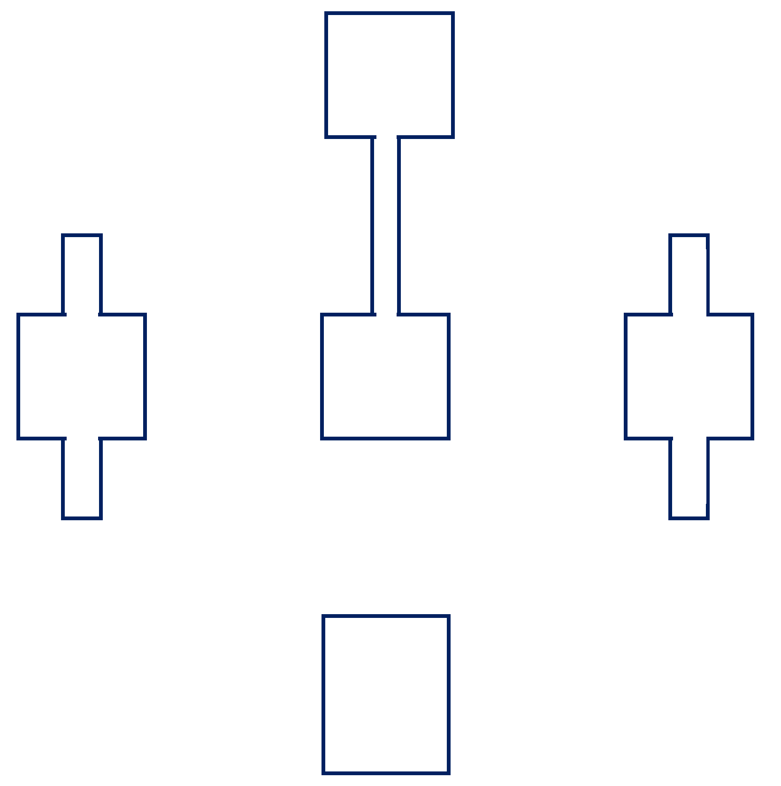

```{r setup, include=FALSE}
knitr::opts_chunk$set(echo = TRUE)
library(knitr)
```


## Effect of corridors on dung beetle diversity, dispersal, & ecosystem services    

### Project Personnel 

- Eric Escobar-Chena (MS student, UF) 
- Emilio Bruna (UF)
- Julian Resasco (UC Boulder)
- 1 field intern (TBD)

### PI Contact Information 

- Emilio Bruna (embruna@ufl.edu)
- Eric Escobar-Chena (eescobarchena@ufl.edu)

### Research proposal (1500 words max): 
<!-- (a) Description of research, including type of sampling and description of any type of manipulation (even if minor)  -->

### Background   

In an increasingly fragmented world, corridors are considered a key strategy for promoting connectivity and facilitating the movement of organisms through the landscape. Such movement is hypothesized to help maintain species diversity in fragments; it could also have patch- and landscape-level consequences for the ecosystem processes in which influenced by these species. Although there is some evidence that animals disperse between patches via corridors, and that connected patches have higher species diversity than unconnected ones, little work to date has investigated the consequences of these corridor-driven patterns for ecosystem ecosystem. 

Dung beetles have emerged as a model system with which to test hypotheses on how changes in landscape structure driven by human activities influence biodiversity. They are locally species rich, exhibit variety in key functional traits (e.g., size, foraging style, resource-use), are capable of long-distance dispersal (e.g., some species up to 1 km), and that they influence a number of critical ecosystem services (e.g., seed dispersal, nutrient cycling). Previous work has shown that isolated patches of habitat frequently have lower dung beetle diversity and abundance than areas of continuous habitat, as well as documented their presence in linear strips of habitat that resemble corridors. However, it remains unknown if corridors can reduce the loss of species from fragments, how such declines are influenced by inter-specific differences in dispersal capability, and what the consequences of these patterns are for the ecosystems services provided by dung beetles. Though there are several reasons for this, one major factor is the challenge in finding locations where one can assess the role of corridors while also while controlling for confounding factors such as patch size, edge, and corridor length. 

**_We propose using the community of dung beetles at the SRS Corridor Experiment to test for_** **(1)** higher species richness, species diversity, and functional diversity in patches connected by corridors than in unconnected patches **(2)** interspecific differences in corridor use and inter-patch movement, and **(3)** higher rates of dung removal in connected than unconnected patches. The SRS Corridor Experiment is an ideal location in which to conduct our stud. The design overcome the primary technical impediments to isolating the effects of corridors _per se_, its spatial scale allows for drawing and realistic and relevant conclusions regarding dung beetle dispersal in fragmented landscapes, and the local dung beetle assemblage is a highly tractable one with which to address our questions (i.e., taxonomically and functionally diverse, keys for species identification are readily available, there are multiple abundant species from different functional groups with which to conduct experiments, and the experimental/survey methods are standardized and straightforward). 

**_Our sampling and experiments will test the following predictions:_**

1. Prediction 1: Species Richness, Species Diversity, and Functional Diversity will be higher in patches connected by corridors than in unconnected patches

<!-- 2. Predictions 2: Corridors facilitate inter-patch movement of dung beetle species,  -->
2. Prediction 2: Corridors are suitable habitat for all species. However, the speed at which in individuals move through corridors and the probability of successful inter-patch movement is size-dependent (i.e., larger beetle species move more quickly and are more likely to reach the connected patch).     

3. Dung removal rates will be highest in connected patches. This is due to the higher functional diversity of beetles in these locations.  

Below we describe the combinations of sampling and experiments with which we will test these predictions. 

### Methods  

<!-- (b) Number and location of study areas, including a map of proposed sites and their relation to ongoing studies -->

_Study site_  

1. Design Prediction 1 (pitfall sampling)
1. Design Prediction 2 (MRR)
1. Design Prediction 3 (Dung Removal Experiment)

{fig-align="center" width=95% height=95%}


Each experimental landscape block consists of a 1-ha square center patch surrounded by four peripheral patches that are equal in area (~1.4 ha) but differ in the amount of habitat connectivity or edge (Fig. 1). One peripheral patch is connected to the center patch by a 150 x 25-m corridor (hereafter “connected”). The isolated patches are also 150 m from the center patch and vary in their edge amount. The winged patch type (hereafter “isolated high edge”) is a 100 x 100-m square with two 75 x 25 -m projections on either side of the patch. The rectangular patch type (hereafter “isolated low edge”) consists of a 100 x 100-m square with an area equal in size to the corridor added to the part of the patch farthest from the center patch. Each block contains one of each patch type and a duplicate of one of the isolated patch types.


<!-- Fig. 1 – Schematic of experimental design showing 1 of the 7 blocks. Center patches (lower left) are planted by with 16 source populations of wild sunflowers from locations throughout the US (from US-NPGS; represented by rainbow colors) and will be randomly assigned to a grid pole location. Connected and one unconnected patch, C location (rectangular or winged) will each be planted with an inbred line (HA 467). -->


_Focal Species Assemblage_

1. How many species, functional groups, range in size, what is known about them
1. Table of expected species 

_Potential impacts on corridor plots and ongoing studies_

1. no holes are being dug for pitfalls: no disturbance of the seeds or soil
1. changes in dung beetle abundance due to collection: short term, unlikely to be high impact
1. Dung introduced into plots: contained in above ground traps, so also unlikely, standardized and from cows taking abntibiotics, so no disease introduced,.


_Study duration_ 

1. Preliminary sampling during Spring 2023
1. Summer and Fall Sampling
<!-- Plan for how the study will be cleaned-up -->
1. All traps and pin flags will be removed after each sampling bout

_Funding sources (if applicable)_


_Plan for making data publicly accessible_

Data will be entered into spreadsheets and backed up by saving them to a repository on the Bruna Lab's Github site (https://github.com/BrunaLab)  along with a .txt file of metadata and all R scripts for data correction and analysis. When new data are added they will be automatically validated using  Github actions and the `pointblank` library (e.g., https://brunalab.github.io/HeliconiaSurveys/survey_validation/survey_validation.html). This approach allows us to share the all materials with collaborators and easily archive code and data at Zenodo and Dryad (respectively) upon the acceptance of a manuscript. For an overview of our approach to data archiving and accessibility see https://github.com/BrunaLab/HeliconiaSurveys


