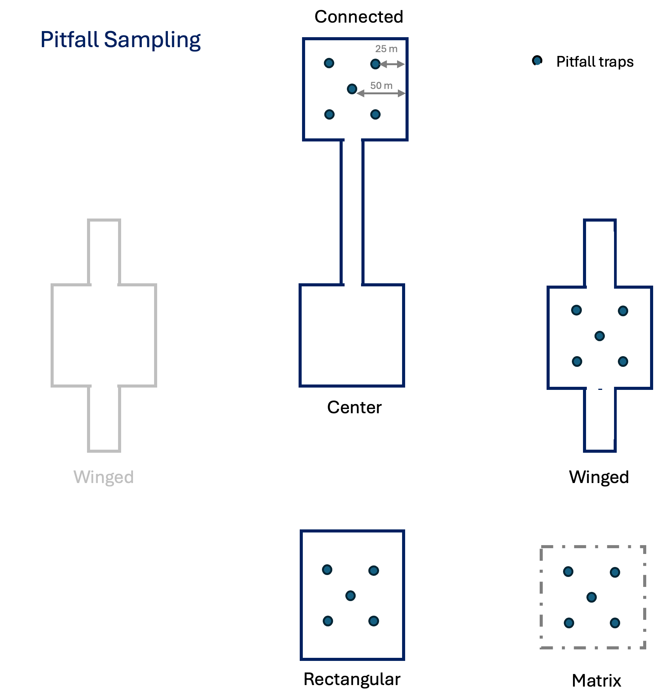
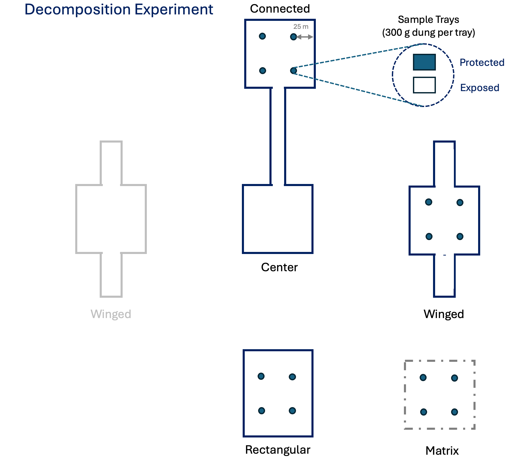

```{r setup, include=FALSE}
knitr::opts_chunk$set(echo = TRUE)
library(knitr)
library(here)
```
## Influence of corridors on dung beetle diversity, dispersal, & ecosystem services

### Project Personnel 

- Eric Escobar-Chena (MS student, UF) 
- Emilio M. Bruna (MS Committee Chair, UF)
- Julian Resasco (MS Committee Member, UC Boulder)
- 1 undergraduate field intern (TBD)

### PI Contact Information 

- Eric Escobar-Chena (eescobarchena@ufl.edu)
- Emilio Bruna (embruna@ufl.edu)

## Research proposal 
<!-- (a) Description of research, including type of sampling and description of any type of manipulation (even if minor)  -->

### Background   

Corridors have been shown to be an important mechanism for facilitating the movement of organisms through fragmented landscapes. These movements are hypothesized to prevent species diversity from declining in fragments, as well as help maintain the ecosystem services provided by these species (at both the patch- and landscape-level). Although there is some evidence that animals disperse between patches via corridors, and that connected patches have higher species diversity than unconnected ones, little work to date has investigated the consequences of these corridor-driven patterns for ecosystem services. 

Dung beetles have emerged as a model system with which to test hypotheses on how changes in landscape structure driven by human activities influence biodiversity and their ecosystem services. The removal, breakdown, and burial of animal feces is an important ecosystem service provided by dung beetles such as enhanced nutrient cycling and soil quality and reduction of parasites on methane emissions from dung. Local assemblages of dung beetles can be species-rich with species comprising a broad range of functional traits (e.g., size, foraging style, resource-use). Previous studies have shown that isolated patches of habitat frequently have lower dung beetle diversity and abundance than areas of continuous habitat, as well as documented their presence in linear strips of habitat that resemble corridors. However, it remains unknown if corridors actually act to reduce the loss of dung beetle species from fragments, if such declines are influenced by inter-specific differences in dispersal capability, and what the consequences of these patterns are for the ecosystems services they provide. One major factor behind this lack of information is the challenge in finding locations where one can assess the role of corridors while also while controlling for confounding factors such as patch size, edge, and corridor length. 

**We propose using the community of dung beetles at the SRS Corridor Experiment to test the following predictions:**

1. **Prediction 1:** Species Richness, Species Diversity, and Functional Diversity will be higher in patches connected by corridors than in unconnected patches.

3. **Prediction 2:** Dung removal rates will be highest in connected patches. This is due to the higher functional diversity of beetles in these locations.

2. **Prediction 3:** Corridors facilitate the dispersal of all species. However, the speed at which in individuals move through corridors and the probability of successful inter-patch movement is size-dependent (i.e., larger beetle species move more quickly and are more likely to reach the connected patch).

<!-- **_The Corridor Experiment is an ideal location in which to conduct this project._** Its design overcomes the primary technical impediments to isolating the effects of corridors _per se_, and the spatial scale allows for drawing and realistic and relevant conclusions regarding dung beetle dispersal in fragmented landscapes. In addition, the local dung beetle community is a highly tractable one with which to address our questions: the ~16 species span a broad range of abundance and functional traits, their taxonomy is well resolved, their identification is straightforward, and methods surveying their diversity and using them in experiments are well-established. Below we describe the sampling and experiments with which we will test our predictions. The proposed designs are informed by a year-long study of dung beetle community structure we conducted at the University of Florida's Ordway-Swisher Biological Station; any revisions made to the design following preliminary data collection in Spring 2024 will be submitted for review by the Steering Committee.  -->

### Study Site and Methods   

We propose to conduct the field component of our study in seven of the Savannah River Site's experimental landscapes (i.e., 'blocks') designed to assess the ecological effects of corridors. Each experimental landscape (i.e., "block") consists of a 1-ha square central patch surrounded by four peripheral patches. All peripheral patches separated from the 150 m from the central patch and have the same area (~1.4 ha), However, the four peripheral patches differ in their level of connectivity to the central patch and edge:area ratio (Figure 1). 
<!-- The "connected patch" is 100m $\times$ 100m and connected to the center patch by a 150m $\times$ 25m corridor. The two "winged patches" are 100m $\times$ 100m; each of these patches has two linear projections of 75m $\times$ 25m extending from opposite sides of the patch. Finally, the "rectangular patch" is a 100m $\times$ 100m square to which an area equal to that of the corridor/wings has been attached to the edge furthest from the central patch  .  -->
 
**_Methods - Beetle Diversity_:** To test the effect of corridors on species richness, species diversity, and functional diversity we will sample the dung beetle community in each location with pitfall traps baited with cow dung. In each of the seven landscapes we will sample in four locations: the "connected" patch, the "rectangular" patch, one of the "winged" patches, and an area of matrix habitat at least 150 m from any of the patches (Figure 1). In each location we will arrange N = 5 traps located	$\geq$ 25m from the patch edge to reduce the likelihood of attracting beetles from the the matrix habitat. Each trap will be baited with 300 mg of cow dung (collected at the University of Florida’s Beef Teaching Unit and frozen until needed) suspended over a vial of 95% ethanol. The N = 20 traps in a landscape will be set on the same day and remain open for 24 hours; sampling will be conducted monthly for 8 months to capture temporal variation in community structure. We will establish a reference collection with identification keys for the Corridor Project and deposit voucher specimens at the Florida Museum of Natural History.

<!-- Pitfall traps are constructed from 15 cm sections of PVC pipe (diameter = 10 cm). A metal screen has been attached to the bottom of the PVC, while a 14 cm diameter funnel has been inserted to the top. The with an extended --cm plastic platform used to suspend the trap over a hole in the ground. The traps will be set level to the ground by placing them into a semi-permanent hole that was maintained by a larger section of PVC while traps were not in use. Dung is wrapped in paper towel to exclude beetles and suspended over the trap on a wire cloth platform. Note that although the traps of Wood and Kaufman (2008) were designed as a live catch trap, ours will be converted to a wet trap by placing a --ml cup containing 95% ethanol inside the trap (the original design allows some beetles to escape and for predatory beetles to enter the traps). -->

<!-- The dung used to bait traps will be collected from the University of Florida’s Beef Teaching Unit from cattle that were unsupplemented – (with what). It is  collected fresh in the morning, homogenized, and formed into approximately (_ml) balls and frozen at (_degrees Celsius) until deployment. While some dung beetles have a clear preference for a particular type of dung, most species are generalists that use a broad diversity of vertebrate excrement (cite - check Gordon 1983, and Mart´in Piera and Lobo 1996, and see what Woodruff has to say; see page 13 of Haffter and Edmonds). All beetles captured will stored in 95% ethanol and identified to species or morphospecies using Woodruff (1973). A collection of voucher specimens will be deposited at the FLMNH and ------. -->

<!-- - 5 traps in a grid in the central 50 $\times$ 50 m of each patch + 1 sampling grid in the matrix. The 25 m buffer from the edge is to avoid beetles coming into the plot from the matrix. -->
<!-- - will try to test buffer width with marked beetles released at different distances, including from outside matrix -->
<!-- - 4 arrays per blocks = 36 traps per array, 7 blocks = 252 traps total -->
<!-- - need to make sure - ebnough "coverage" without a buffer too small, meaning bugs from matrix come into patch -->

<!-- {fig-align="center" width=45% height=45%} -->

<!-- ```{r echo=FALSE, out.width = "45%", fig.align = "center"} -->

<!-- knitr::include_graphics(here("corridor_docs","proposal","images", "plots1.png")) -->
<!-- ``` -->


**_Field Methods - Dung removal_:** We will compare the efficacy of dung removal by beetle communities in connected, unconnected, and winged patches with a field experiment to be conducted in seven of the experimental blocks. We first will establish a grid of N = 4 points in each of the patches in which we previously sampled beetle diversity to test Prediction 1 (Figure 2). At each point in the grid we will place two 'plant saucers' filled with 3 inches of homogenized local soil in which we place 300 g of cow dung; one of the saucers will be protected with mesh to prevent beetle access. After 48 hours the saucers will be removed and the remaining dung will be weighed (the weight of the protected dung is used to correct for weight loss from desiccation). Experiments will be conducted monthly in each landscape (N = 6) months to capture temporal variation in patterns of dung removal. This field experiment will be complemented by a mesocosm study with experimentally assembled communities (based on the results of surveys for testing Prediction 1) to be conducted at the University of Florida. 

<!-- -  to consider: gather and sieve soil from outside, place in shallow pot, and place dung on that. Allows breakdown of soil without getting into their soils, if this is a concern -->
<!-- - repeat biweekly for X months  -->
<!-- - lab experiment: meso-cosms in GNV based on results from diversity sampling  -->
<!-- - need to make sure each point inside a plot is independent, and that each sampling date is independent -->
<!-- plant saucers: http://tinyurl.com/3ph2wd6b -->


<!-- {fig-align="center" width=45% height=45%,fig.pos="H"} -->

<!-- ```{r fig1, echo=FALSE, fig.align="center", out.width = "100%",fig.cap='TEXT'} -->
<!-- p1<-cowplot::ggdraw() +cowplot::draw_image("./corridor_docs/proposal/images/plots3.png") -->
<!-- p1 -->
<!-- ``` -->

**_Methods - Beetle dispersal_:** To determine if beetles use corridors to move between patches, and if patterns of movement differ between species based on their size, we will conduct a mark-release-recapture (i.e., MRR) experiment. A pitfall trap will be placed in the middle of the landscape's "center" patch and baited with 300 g of cow dung. We will then release marked beetles at two points equidistant from the bait -- the "connected" patch and the edge of the "rectangular" patch (Figure 3) -- and monitor the baited pitfall trap for N = 3 days. This design will allow us to determine (a) if beetles disperse between patches using corridors, (b) if beetles disperse through the matrix, and (c) if beetles dispersing via corridors move more quickly or have higher a higher probability of successful dispersal.

We anticipate conducting this experiment with two locally common and abundant species that differ 70-fold in biomass: _Dochotomius carolinus_ (avg. dry biomass = 0.634 g $\pm$ 0.245 SD, N=10 individuals) and _Ateuchus lecontei_ (avg dry biomass  = 0.009 g $\pm$ 0.002 SD, N = 22 individuals). The individuals used in the experiment will be captured locally in matrix habitat; our prior sampling in Florida indicates these species are among the most abundant in Pine savanna. While we anticipate field collection will yield sufficient beetles to conduct a robust MRR analysis, we will also attempt to establish breeding colonies at UF.
 
As part of our efforts to determine the necessary sample sizes of individuals to use in trials, we will conduct preliminary dispersal trials in both the corridor and matrix with grids of passive traps (i.e., no dung bait). This will also help us determine if a single 'destination trap' is sufficient. These preliminary results will in turn determine the number of landscapes in which we can conduct the experiment and how many times it will be repeated. 
<!-- - to consider: passive traps to see if they are moving through? should we start experiment with smaller distances into the orridor and then eventually the full length?  -->
<!-- - is there any technology to track or follow them? RFID? etc? -->


<!-- {fig-align="center" width=45% height=45%,fig.pos="H"} -->

<!-- Fig. 1 – Schematic of experimental design showing 1 of the 7 blocks. Center patches (lower left) are planted by with 16 source populations of wild sunflowers from locations throughout the US (from US-NPGS; represented by rainbow colors) and will be randomly assigned to a grid pole location. Connected and one unconnected patch, C location (rectangular or winged) will each be planted with an inbred line (HA 467). -->


### Potential impacts on corridor plots and ongoing studies

Each pitfall trap requires digging a cylindrical hole ~10 cm wide $\times$ ~10 cm deep, but the trap's base can remain in place until all surveys are complete (with a cover when not in use). This, coupled with the number of traps we are deploying per patch, means that disturbance of plots will be minimal. The number of insects collected is also unlikely to have a large or long-term impact on their populations or ecosystem processes. The dung removal experiment was also designed to have a minimal impact. The amount of dung used in the plot is relatively small, and by conducting the trials with plant saucers placed on the soil surface we greatly reduce the possibility of dung beetle activity disturbing seed banks or altering soil properties (chemistry, structure) in experimental microsites. Finally, it is highly unlikely that the dung used in baits will expose local animals to novel disease. Any pathogens or parasites that persist in the guts of donor cows despite the efforts of UF's veterinarians, and then survive several months in a freezer, will only be in the field for 24-72 hours.   

All traps and markings will be removed at the study's conclusion. 


### Study duration

1. Preliminary sampling during March-May 2024
1. Sampling and Dung Removal Experiments: June 2024-March 2025
1. Dispersal Experiments: August-September 2024

### Funding sources

We have much of the equipment necessary to complete the project, and a modest budget to buy new equipment or defer some transportation expenses. We are actively seeking funds to support travel and living expenses during the summer. 

### Plan for making data publicly accessible

Data will be entered into spreadsheets and backed up by saving them to a repository on the Bruna Lab's Github site (https://github.com/BrunaLab)  along with a .txt file of metadata and all R scripts for data correction and analysis. When new data are added they will be automatically validated using  Github actions and the `pointblank` library (e.g., https://brunalab.github.io/HeliconiaSurveys/survey_validation/survey_validation.html). This approach allows us to share the all materials with collaborators and easily archive code and data at Zenodo and Dryad (respectively) upon the acceptance of a manuscript. For an overview of our approach to data archiving and accessibility see https://github.com/BrunaLab/HeliconiaSurveys

<!-- \newpage -->


## Figures


{fig-align="center" width=45% height=45%}

{fig-align="center" width=45% height=45%}

{fig-align="center" width=45% height=45%}

